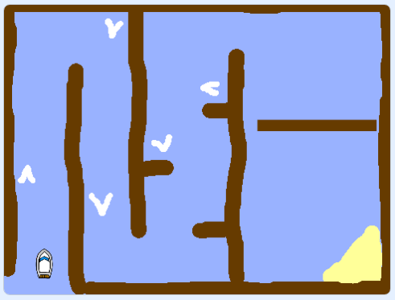

## पुढे काय?

आता आपण 'पेंट बॉक्स' प्रोजेक्ट पूर्ण केल्यावर ['बोट रेस' प्रोजेक्ट](https://projects.raspberrypi.org/mr-IN/projects/boat-race?utm_source=pathway&utm_medium=whatnext&utm_campaign=projects) अर्थात नाव शर्यत प्राजेक्ट करूण बघा. तीथे आपल्याला गेम बनविण्यात मदत दिली जाइल, आण आपल्याला अडथळ्यांभोवती बोटी हलवावी लागेल.

--- no-print ---

  <iframe allowtransparency="true" width="485" height="402" src="https://scratch.mit.edu/projects/embed/276662533/?autostart=false" frameborder="0" scrolling="no"></iframe>
  

--- /no-print ---

--- print-only ---

--- /print-only ---

***
या प्रकल्पाचे भाषांतर स्वयंसेवकांनी केले:

Ashish
DJ

स्वयंसेवकांचे आभार, आम्ही जगभरातील लोकांना त्यांच्या भाषेतून शिकण्याची संधी देऊ शकतो. आपण आम्हाला भाषांतर करण्यासाठी स्वयंसेवा करून अधिक लोकांपर्यंत पोहोचण्यास मदत करू शकता - अधिक माहिती [rpf.io/translate](https://rpf.io/translate) वर.