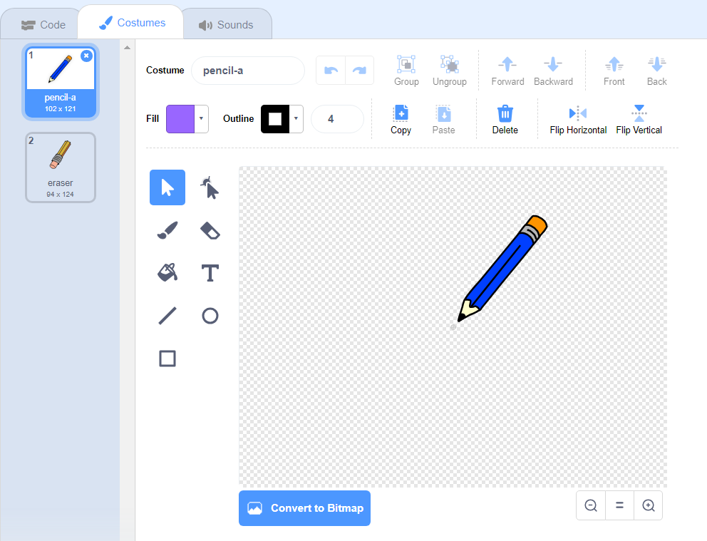

## Membuat pensil

Mari kita mulakan dengan membuat pensil yang boleh digunakan untuk menarik di panggung.

+ Buka projek Scratch 'Paintbox' dalam talian di [jumpto.cc/paint-go](http://jumpto.cc/paint-go){: target = "_ blank"} atau muat turun dari <http://jumpto.cc/paint-get>{: target = "_ blank"} dan kemudian buka jika anda menggunakan editor luar talian.

Anda akan melihat pensil dan pensel pemadam:


+ Tambah beberapa kod pada sprit pensil untuk membuat ia mengikuti mouse `selama`{: class = "blockcontrol"} supaya anda dapat menarik:

```blocks
    apabila bendera diklik selamanya pergi ke [penunjuk tetikus v] akhir
```

+ Klik bendera dan kemudian gerakkan tetikus di sekitar panggung untuk menguji sama ada kod tersebut berfungsi.

Seterusnya, mari buat pensil anda hanya menggambar `jika`{: class = "blockcontrol"} tetikus telah diklik.

+ Tambahkan kod ini pada sprit pensil anda:


+ Uji kod anda sekali lagi. Kali ini, gerakkan pensil di sekitar panggung dan tahan butang tetikus. Bolehkah anda menarik dengan pensil anda?


## \--- runtuh \---

## tajuk: Jika anda menghadapi masalah ...

Jika pensil anda kelihatan menarik garis dari tengah pensil dan bukan hujungnya, anda perlu mengubah pusat pakaian anda.



Crosshair untuk pensil mesti diletakkan **tepat di bawah** ujung pensil, bukan di ujung pensil.

Perubahan dalam 'pakaian kostum' sprite tidak didaftarkan sehingga tab lain diklik, jadi klik pada pakaian lain, atau pada tab 'Skrip' untuk memuktamadkan perubahan anda pada pusat pakaian.

\--- / runtuh \---