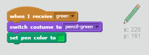

## Pensel warna

Mari tambahkan pensel warna yang berlainan kepada projek anda, dan biarkan pengguna memilih antara mereka.

+ Klik pada sprit pensil anda, klik 'Kostum' dan duplikat kostum 'pensil-biru' anda.


+ Namakan semula pakaian baru anda 'pensil-hijau', dan warna pensil hijau.


[[[generic-scratch-rename-sprite]]]

+ Lukis dua sprite baru - satu persegi biru dan satu persegi hijau. Anda akan menggunakannya untuk memilih pensil biru atau hijau.


+ Namakan semula sprite anda supaya mereka dipanggil 'biru' dan 'hijau'

+ Menambah beberapa kod kepada bidadari 'hijau' supaya apabila ia diklik, ia akan `siaran`{: class = "blockevents"} mesej "hijau" kepada bidadari pensel, memberitahu ia untuk menukar pakaian dan pensil warna.


[[[generic-scratch-broadcast-message]]]

+ Beralih ke sprit pensil anda. Tambah beberapa kod supaya apabila sprite ini menerima `siaran`{: class = "blockevents"} hijau, ia harus bertukar kepada kostum pensil hijau dan menukar warna pena menjadi hijau.



Untuk menetapkan pensil warna ke hijau, klik kotak berwarna di `set warna pen`{: class = "blockpen"}, dan klik pada sprit hijau untuk memilih warna hijau yang sama dengan warna pensil anda.

+ Anda kini boleh melakukan perkara yang sama untuk ikon pensil biru: tambah kod ini pada sprite biru persegi:

```blocks
apabila sprite ini mengklik siaran [biru v]
```

... dan tambah kod ini pada sprit pensil:

```blocks
apabila saya menerima kostum suis [v v] untuk [pensil-biru v] menetapkan warna pen kepada [# 0000ff]
```

+ Akhirnya, tambahkan kod ini untuk memberitahu sprit pensil yang warna bermula, dan pastikan bahawa skrin adalah jelas.


Kami memilih untuk memulakan dengan warna biru tetapi jika anda lebih suka, anda boleh mulakan dengan pensel warna yang berbeza.

+ Uji projek anda. Bolehkah anda menukar antara pena biru dan hijau dengan mengklik pada sprite persegi biru atau hijau?

