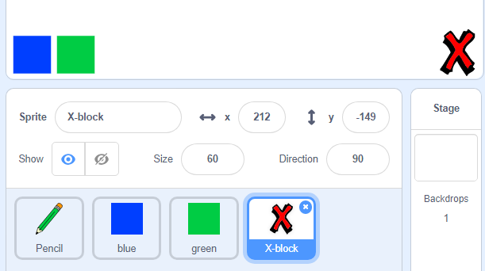

## Membuat kesilapan

Terkadang kesilapan berlaku, jadi mari tambahkan butang 'jelas' dan penghapus.

+ Tambah sprite 'X-block' - anda akan dapati di perpustakaan, di bahagian surat. Warna pakaian berwarna merah. Ini akan menjadi butang 'jelas'.



+ Tambah kod ke sprite ini untuk membersihkan panggung apabila ia diklik.


Perhatikan bahawa anda tidak perlu menghantar mesej untuk membersihkan panggung, anda hanya boleh menggunakan blok yang jelas dari sprite ini.

Anda mungkin perasan bahawa pensel pensel anda termasuk kostum penghapus:


+ Projek anda juga termasuk sprite pemadam yang berasingan. Klik kanan pada sprite ini dan pilih 'show'. Inilah caranya melihat tahap anda:


+ Tambahkan kod ke sprite pemadam, untuk memberitahu pensil untuk beralih ke pemadam apabila sprite diklik.


Apabila pensel menerima mesej "penghapus", anda boleh menukar pakaian pensil kepada pemadam, dan menukar warna pensil kepada warna putih - warna yang sama seperti pentas!

+ Tambah beberapa kod untuk membuat pemadam

\--- petunjuk \--- \--- petunjuk \--- Tambah beberapa kod untuk sprit pensil: **Apabila saya menerima** **pemadam** mesej **Beralih ke pakaian** pemadam **Tetapkan warna pen** ke putih \--- / petunjuk \--- \--- petunjuk \--- Inilah bagaimana kod di dalam sprit pensil harus dilihat:

```blocks
apabila saya menerima pakaian suis [eraser v] ke [eraser v] menetapkan warna pen kepada [#FFFFFF]
```

\--- / petunjuk \--- \--- / hints \---

+ Uji projek anda, untuk melihat apakah anda boleh membersihkan dan memadamkan di atas panggung.


Terdapat satu lagi masalah dengan pensel - anda boleh menarik mana-mana di atas pentas, termasuk berhampiran ikon pemilih!


Untuk membetulkan ini, beritahu pensil hanya untuk menarik jika tetikus diklik *dan* jika kedudukan y-tetikus lebih besar daripada -120:


+ Uji projek anda; anda sekarang tidak boleh menarik berhampiran blok pemilih.

