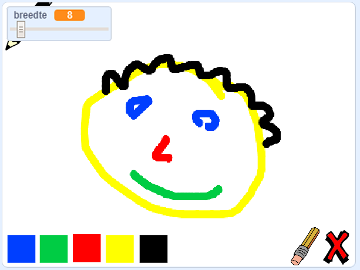

--- no-print ---

Dit is de **Scratch 3** versie van het project. Er is ook een [Scratch 2 versie van dit project](https://projects.raspberrypi.org/nl-NL/projects/paint-box-scratch2).

--- /no-print ---

## Inleiding

Maak je eigen teken programma!

### Wat ga je maken

--- no-print --- 

Klik op de groene vlag om te starten. Gebruik de muis om het potlood te verplaatsen en houd de linkermuisknop ingedrukt om te tekenen. Klik op een kleur om van potlood te wisselen. Klik op de gum om daar naar toe te wisselen en gebruik deze om je werk uit te gummen. Klik op het kruisje om de hele pagina te wissen.

  <iframe allowtransparency="true" width="485" height="402" src="//scratch.mit.edu/projects/embed/267243161/?autostart=false" frameborder="0" scrolling="no"></iframe>
  

--- /no-print ---

--- print-only --- 

Je klikt op de groene vlag om te starten, je gebruikt de muis om het potlood te verplaatsen en houd de linkermuisknop ingedrukt om te tekenen. Door op een kleur te klikken zal de kleur van de penveranderen, en een klik op de gum zal deze in een gum veranderen!

 

--- /print-only ---

--- collapse ---
---
title: Wat ga je leren
---

+ Hoe gebruik je de Pen uitbreiding in Scratch
+ Uitzendingen gebruiken om te communiceren tussen sprites
+ Hoe je muisacties detecteert 

--- /collapse ---

--- collapse ---
---
title: Wat heb je nodig
---

### Hardware

+ Een computer die Scratch 3 kan uitvoeren

### Software

+ Scratch 3 (of [online](http://rpf.io/scratchon){:target="_blank"} of [offline](http://rpf.io/scratchoff){:target="_blank"})

### Downloads

+ [Offline startproject](http://rpf.io/p/nl-NL/paint-box-go){:target="_ blank"}

--- /collapse ---

--- collapse ---
---
title: Aanvullende informatie voor docenten
---

Als je dit project wilt afdrukken, gebruik dan de [printvriendelijke versie](https://projects.raspberrypi.org/nl-NL/projects/paint-box/print){:target="_ blank"}.

Hier is een link [naar de oplossing](http://rpf.io/p/nl-NL/paint-box-get){:target="_blank"} voor dit project. 

--- /collapse ---