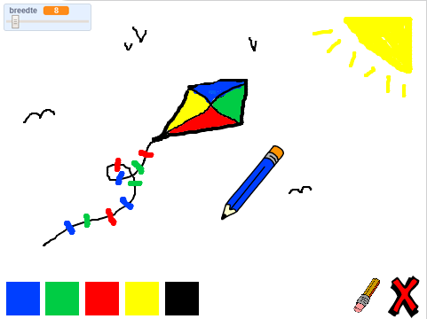

## Inleiding

Maak je eigen teken programma!

### Wat ga je maken

Klik op de groene vlag om te starten. Gebruik de muis om het potlood te verplaatsen en houd de linkermuisknop ingedrukt om te tekenen. Klik op een kleur om van potlood te wisselen of klik op het gum om je werk uit te gummen. Klik op het kruisje om alles te wissen.

  <iframe allowtransparency="true" width="485" height="402" src="https://scratch.mit.edu/projects/embed/63473366/?autostart=false" frameborder="0"></iframe>
  

### Wat ga je leren

This project covers elements from the following strands of the [Raspberry Pi Digital Making Curriculum](http://rpf.io/curriculum){:target="_blank"}:

+ [Combine programming constructs to solve a problem.](https://www.raspberrypi.org/curriculum/programming/builder){:target="_blank"}

### Additional information for educators

If you need to print this project, please use the [printer friendly version](https://projects.raspberrypi.org/en/projects/paint-box/print){:target="_blank"}.

Use the link in the footer to access the GitHub repo for this project, which contains all resources (including an example finished project) in the 'en/resources' folder.