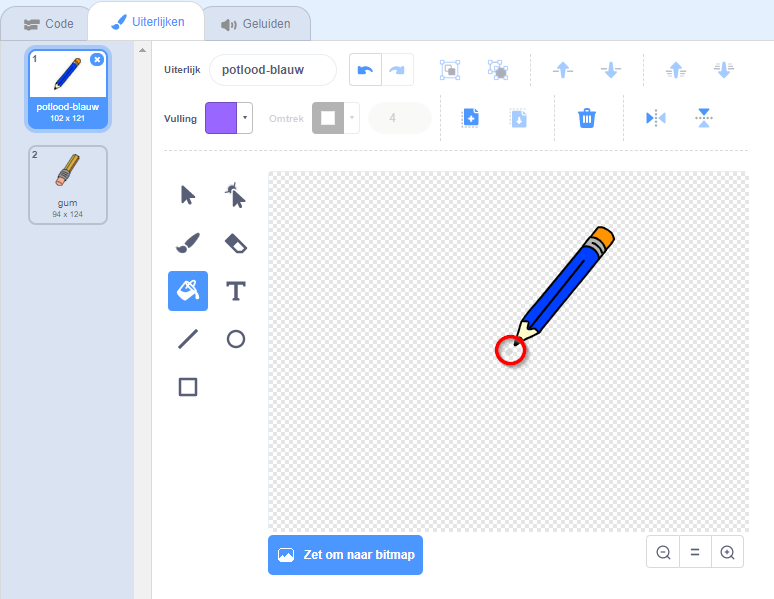

## Wat heb je nodig

Laten we beginnen met het maken van een potlood dat kan worden gebruikt om op het speelveld te tekenen.

\--- task \--- Open het "Paint box" start project.

**Online** open het online start project op [rpf.io/paint-box-on](http://rpf.io/paint-box-on){:target="_ blank"}

**Offline**: open het [startproject](http://rpf.io/p/en/paint-box-go){:target="_ blank"} in de offline editor.

Als je de Scratch offline editor wilt downloaden en installeren dan kan je die vinden op [rpf.io/scratchoff](http://rpf.io/scratchoff){:target="_blank"}

In het startersproject zou je een potlood- en een gumsprite moeten zien:

 \--- /task \---

\--- task \----

Voeg de Pen-uitbreiding toe aan je project.

[[[generic-scratch3-add-pen-extension]]]

\--- /task \---

\--- task \---

Voeg wat code toe aan de potlood sprite om ervoor te zorgen dat deze de muis altijd volgt met een `herhaal`{:class="blockcontrol"} blok, zodat je kunt tekenen:


```blocks3
wanneer groene vlag wordt aangeklikt
herhaal
 ga naar (muisaanwijzer v) 
end
```

\--- /task \---

\--- taak \--- Klik op de vlag en verplaats de muisaanwijzer vervolgens door het werkgebied om te testen of je code werkt. \--- /task \---

Laat vervolgens je potlood alleen tekenen `als`{:class="blockcontrol"} er de muisknop wordt ingedrukt.

\--- task \--- Voeg deze code toe aan je potlood sprite:


```blocks3
wanneer groene vlag wordt aangeklikt
herhaal
 ga naar (muisaanwijzer v)
 als <muis ingedrukt?> dan
 pen neer
 anders
 pen op
end


end
```

\--- /task \---

\--- taak \--- Test je code opnieuw. Verplaats deze keer het potlood in het speelveld en houd de muisknop ingedrukt. Kun je met je potlood tekenen?

 \--- /task \---

## \--- collapse \---

## title: Trekt je potlood de lijn niet vanaf de punt?

Als de lijn die je potlood tekent eruit ziet alsof deze uit het midden van het potlood komt, moet je je potlood sprite veranderen, zodat de punt het midden van de sprite is.

Klik op de potlood sprite en klik vervolgens op de **uiterlijken** tab.

Verplaats het hele uiterlijk zodat de punt van het potlood zich **net boven** het midden bevindt.



Beweeg nu het potlood in het speelveld en teken. Het potlood moet nu een lijn trekken vanaf de punt.

\--- /collapse \---