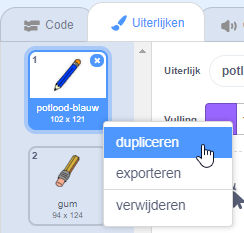
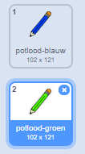
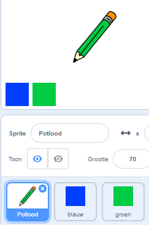

## Kleurpotloden

Laten we verschillende kleurpotloden aan je project toevoegen en de gebruiker de mogelijkheid geven om een kleur te kiezen.

\--- task \--- Klik op de potloodsprite, klik op **Uiterlijken** en dupliceer het 'pencil-blue' uiterlijk.

 \---/task\---

\--- task \--- Hernoem je nieuwe kostuum 'potlood-groen' en kleur het potlood groen.



\--- /task \---

\--- task \--- Teken twee nieuwe sprites - een blauw vierkant en een groen vierkant. Die zijn bedoeld om te kiezen tussen het blauwe en groene potlood.

 \--- /task \---

Hernoem je sprites zodat ze 'blauw' en 'groen' heten

[[[generic-scratch3-rename-sprite]]]

\--- /task \---

\--- task \--- Voeg code toe aan de 'groene' sprite, zodat wanneer op de sprite wordt geklikt het een bericht `zend signaal`{:class="block3events"} "groen" geeft.


```blocks3
wanneer op deze sprite wordt geklikt
zend signaal (groen v)
```

[[[generic-scratch3-broadcast-message]]] \--- /task \---

De potlood sprite moet luisteren naar het "groen" bericht en de kleur van het uiterlijk en potlood kleur wijzigen in groen.

\--- task \--- Schakel over naar je potlood sprite. Voeg wat code toe zodat wanneer deze sprite het `groen` {:class= "blockevents"} signaal ontvangt, deze moet overschakelen naar het groene potlood uiterlijk en de potloodkleur moet veranderen in groen.


```blocks3
wanneer ik signaal [groen v] ontvang
verander uiterlijk naar (potlood-groen v)
maak penkleur [#00CC44]
```

Om het potlood op groen te zetten, klik op het gekleurde vierkant in het `zet pen kleur`{:class="block3extensies"} blok, en klik dan op de groene sprite. \--- /task \---

Doe vervolgend hetzelfde voor een potlood met de kleur blauw.

\--- task \--- Klik op de blauwe vierkante sprite en voeg deze code toe:


```blocks3
wanneer op deze sprite wordt geklikt
zend signaal (blauw v)
```

Klik vervolgens op de potlood sprite en voeg deze code toe: 

```blocks3
wanneer ik signaal [blauw v] ontvang
verander uiterlijk naar (potlood-blauw v)
maak penkleur [#0000ff]
```

\--- /task \---

\--- taak \--- Voeg ten slotte deze code toe om de sprite van het potlood te vertellen met welke kleur deze dient te beginnen, en om ervoor te zorgen dat het scherm leeg is wanneer je programma start.


```blocks3
wanneer groene vlag wordt aangeklikt
wis alles
verander uiterlijk naar (potlood-blauw v)
maak penkleur [#0035FF]
herhaal
 ga naar (muisaanwijzer v)
als <muis ingedrukt?> dan
pen neer
anders
pen op
end
```

\--- /task \---

Als je wilt, kunt je met een ander kleurpotlood beginnen.

\--- task \--- Test your code. Kun je schakelen tussen het blauwe en groene potlood door op de blauwe of groene vierkant te klikken?

 \--- /task \---