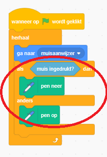
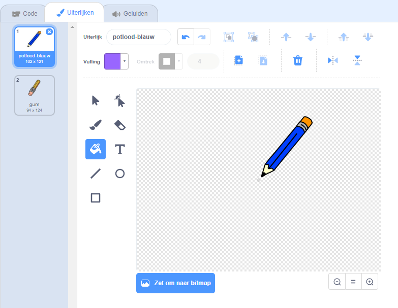

## Een potlood maken

Laten we beginnen met het maken van een potlood dat kan worden gebruikt om op het speelveld te tekenen.

+ Open het 'Paintbox' Scratch-project online op [ jumpto.cc/paint-go ](http://jumpto.cc/paint-go) {: target = "_ blank"} of download van [ http://jumpto.cc/paint-get ](http://jumpto.cc/paint-get) {: target = "_ blank"} en open het als je de offline-editor gebruikt.

Je zult potlood- en gumsprites zien:


+ Voeg wat code toe aan de potloodsprite om ervoor te zorgen dat deze de muis altijd volgt (` herhaal blok`) {: class = "blockcontrol"}, zodat je kunt tekenen:

```blocks
    when flag clicked
    forever
      go to [mouse pointer v]
    end
```

+ Click the flag and then move the mouse around the stage to test whether the code works.

Next, let's make your pencil only draw `if`{:class="blockcontrol"} the mouse has been clicked.

+ Add this code to your pencil sprite:



+ Test your code again. This time, move the pencil around the stage and hold down the mouse button. Can you draw with your pencil?


## \--- collapse \---

## title: If you're having problems...

If your pencil seems to be drawing the line from the middle of the pencil rather than the tip, you will need to change your costume center.



The crosshair for the pencil must be placed **just below** the tip of the pencil, not on the tip of the pencil.

A changes in a sprite's 'costume center' isn't registered until another tab is clicked, so click on another costume, or on the 'Scripts' tab to finalise your changes to the costume center.

\--- /collapse \---