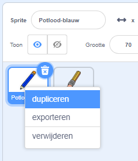

## Kleurpotloden

Laten we verschillende kleurpotloden aan je project toevoegen en de gebruiker de mogelijkheid geven om een kleur te kiezen.

\--- task \--- Klik op de potloodsprite, klik op **Uiterlijken** en dupliceer het 'pencil-blue' uiterlijk.

 \---/task\---

\--- task \--- Name the new costume 'pencil-green', and colour the pencil green.


\--- /task \---

\--- task \--- Teken twee nieuwe sprites - een blauw vierkant en een groen vierkant. Die zijn bedoeld om te kiezen tussen het blauwe en groene potlood.

 \--- /task \---

Hernoem je sprites zodat ze 'blauw' en 'groen' heten

[[[generic-scratch3-rename-sprite]]]

\--- /task \---

\--- task \--- Voeg code toe aan de 'groene' sprite, zodat wanneer op de sprite wordt geklikt het een bericht "groen" `uitzendt`{:class="block3events"}.


```blocks3
wanneer op deze sprite wordt geklikt
zend signaal (groen v)
```

[[[generic-scratch3-broadcast-message]]] \--- /task \---

De potlood sprite moet luisteren naar het "groen" bericht en de kleur van het uiterlijk en potlood kleur wijzigen in groen.

\--- task \--- Schakel over naar je potlood sprite. Add some code so that when this sprite receives the `green`{:class="block3events"} broadcast, it switchs to the green pencil costume and changes the pen colour to green.


```blocks3
when I receive [green v]
switch costume to (pencil-green v)
set pen color to [#00CC44]
```

To set the pencil to colour to green, click the coloured square in the `set pen color`{:class="block3extensions"} block, and then click on the green square sprite. \--- /task \---

Then to a similar thing so that you can switch the pencil colour to blue.

\--- task \--- Click on the blue square sprite and add this code:


```blocks3
when this sprite clicked
broadcast (blue v)
```

Then click on the pencil sprite and add this code: 

```blocks3
when I receive [blue v]
switch costume to (pencil-blue v)
set pen color to [#0000ff]
```

\--- /task \---

\--- task \--- Finally, add this code to tell the pencil sprite which colour to start with, and to make sure that the screen is clear when your program starts.


```blocks3
when flag clicked
+erase all
+switch costume to (pencil-blue v)
+set pen color to [#0035FF]
forever
  go to (mouse pointer v)
if <mouse down?> then
  pen down
  else
  pen up
end
```

\--- /task \---

If you prefer, you can start with a different colour pencil.

\--- task \--- Test your code. Can you switch between the blue and green pencil colours by clicking on the blue or green square sprites?

 \--- /task \---