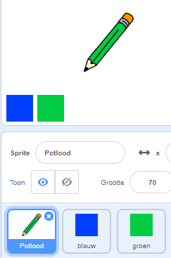

## Kleurpotloden

Laten we verschillende kleurpotloden aan je project toevoegen en de gebruiker de mogelijkheid geven om een kleur te kiezen.

+ Klik op je potloodsprite, klik op 'Uiterlijken' en maak een kopie van je 'pencil-blue' uiterlijk.


+ Hernoem je nieuwe kostuum 'potlood-groen' en kleur het potlood groen.


[[[generic-scratch-rename-sprite]]]

+ Teken twee nieuwe sprites - een blauw vierkant en een groen vierkant. Je gaat deze gebruiken om het blauwe of groene potlood te selecteren.



+ Hernoem je sprites zodat ze 'blauw' en 'groen' heten

+ Voeg wat code toe aan de 'groene' sprite, zodat wanneer er op geklikt wordt, het ` zend signaal` {: class = "blockevents"} het bericht "groen" naar de potloodsprite zal gaan, zeggend dat het zijn uiterlijk en de potloodkleur moet veranderen.


[[[generic-scratch-broadcast-message]]]

+ Schakel over op je potloodsprite. Voeg wat code toe zodat wanneer deze sprite het ` zend signaal ` {: class = "blockevents"} groen ontvangt, deze moet overschakelen naar het groene potlooduiterlijk en de potloodkleur moet veranderen in groen.


Als je het potlood op groen wilt zetten, klik je op het gekleurde vak van het groene blok ` penkleur instellen ` {: class = "blockpen"} en klik je op de groene sprite om dezelfde kleur groen te kiezen als je potlood kleur.

+ Je kunt nu hetzelfde doen voor het blauwe potloodpictogram: voeg deze code toe aan de blauwe vierkante sprite:

```blocks
wanneer op deze sprite wordt geklikt
zend signaal [blauw]
```

... en voeg deze code toe aan de potloodsprite:

```blocks
when I receive [blue v]
switch costume to [pencil-blue v]
set pen color to [#0000ff]
```

+ Finally, add this code to tell the pencil sprite which colour to start with, and make sure that the screen is clear.


We chose to start with blue but if you prefer, you can start with a different colour pencil.

+ Test out your project. Can you switch between blue and green pens by clicking on the blue or green square sprites?

