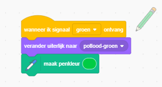
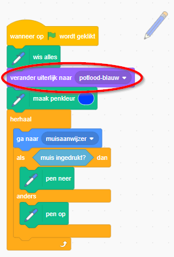

## Kleurpotloden

Laten we verschillende kleurpotloden aan je project toevoegen en de gebruiker de mogelijkheid geven om een kleur te kiezen.

+ Klik op je potloodsprite, klik op 'Uiterlijken' en maak een kopie van je 'pencil-blue' uiterlijk.


+ Hernoem je nieuwe kostuum 'potlood-groen' en kleur het potlood groen.


[[[generic-scratch-rename-sprite]]]

+ Teken twee nieuwe sprites - een blauw vierkant en een groen vierkant. Je gaat deze gebruiken om het blauwe of groene potlood te selecteren.


+ Hernoem je sprites zodat ze 'blauw' en 'groen' heten

+ Voeg wat code toe aan de 'groene' sprite, zodat wanneer er op geklikt wordt, het ` zend signaal` {: class = "blockevents"} het bericht "groen" naar de potloodsprite zal gaan, zeggend dat het zijn uiterlijk en de potloodkleur moet veranderen.


[[[generic-scratch-broadcast-message]]]

+ Schakel over op je potloodsprite. Add some code so that when this sprite receives the `broadcast`{:class="blockevents"} green, it should switch to the green pencil costume and change the pen colour to green.



To set the pencil to colour to green, click the coloured box in the `set pen color`{:class="blockpen"} block, and click on the green sprite to choose the same colour green as your pencil colour.

+ You can now do the same for the blue pencil icon: add this code to the blue square sprite:

```blocks
when this sprite clicked
broadcast [blue v]
```

...and add this code to the pencil sprite:

```blocks
when I receive [blue v]
switch costume to [pencil-blue v]
set pen color to [#0000ff]
```

+ Finally, add this code to tell the pencil sprite which colour to start with, and make sure that the screen is clear.



We chose to start with blue but if you prefer, you can start with a different colour pencil.

+ Test out your project. Can you switch between blue and green pens by clicking on the blue or green square sprites?

