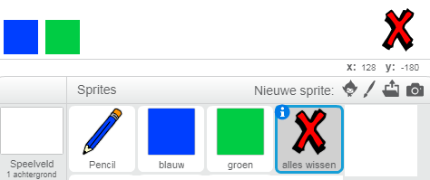
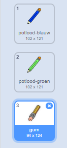

## Fouten maken

Soms maak je fouten, dus laten we een knop 'wissen' en een gum toevoegen.

\--- task \--- Voeg de sprite 'Block-X' toe uit de Letters-sectie in de bibliotheek. Kleur het sprite-uiterlijk rood en maak het een beetje kleiner. Dit wordt de knop 'wissen'.

[[[generic-scratch3-sprite-from-library]]]

 \--- /task \---

\--- task \--- Voeg code toe aan de 'Wissen' sprite om het speelveld te wissen wanneer op de sprite wordt geklikt.


```blocks3
wanneer op deze sprite wordt geklikt
wis alles
```

\--- /task \---

Je hoeft geen `zend signaal`{:class="block3events"} te gebruiken om het speelveld te wissen, omdat het `wis alles`{:class="block3extensions"} blok dat werk doet.

Zie je dat de potlood sprite een gum uiterlijk bevat?



Je project bevat ook een afzonderlijke gumsprite.

\--- task \--- Klik op de gum sprite en klik vervolgens op het oogje naast **Toon** om deze sprite weer te geven. Hier is hoe je speelveld eruit zou moeten zien:

 \--- /task \---

\--- task \--- Voeg code toe aan de gum sprite om een `zend signaal`{:class="block3events"} 'gum' te verzenden wanneer op de gum sprite wordt geklikt.


```blocks3
wanneer op deze sprite wordt geklikt
zend signaal (gum v)
```

\--- /task \---

Wanneer het potlood de "gum"-boodschap ontvangt, zou het potlood uiterlijk in de gum moeten veranderen en de potloodkleur in wit moeten veranderen - dezelfde kleur als de achtergrond van het speelveld!

\--- task \--- Voeg code toe om de gum te maken.

\--- hints \--- \--- hint \--- Voeg wat code toe aan de potlood sprite: `Wanneer ik als signaal ontvang`{:class="block3events"} het `gum`{:class="block3events"} bericht `Verander uiterlijk naar gum`{:class="block3looks"} `Maak penkleur`{:class="block3extensions"} wit \--- /hint \--- \--- hint \--- Hier zijn alle blokken die je nodig hebt:

```blocks3
maak penkleur [#FFFFFF]
wanneer ik signaal [gum v] ontvang

verander uiterlijk naar (gum v)
```

\--- /hint \--- \--- hint \--- Hier is hoe je code eruit zou moeten zien: 

```blocks3
wanneer ik signaal [gum v] ontvang
verander uiterlijk naar (gum v)
maak penkleur [#FFFFFF]
```

\--- /hint \--- \--- /hints \--- \--- /task \---

\--- task \--- Test je project om te zien of je het speelveld kunt wissen en potloodlijnen kunt wissen.

 \--- /task \---

Er is nog een probleem met het potlood - je kunt overal op het podium tekenen, ook in de buurt van de selectie-pictogrammen voor kleur, wis en gum!


\--- task \--- Om dit te verhelpen, wijzig je de code zodat de pen alleen naar beneden is (neer) als je op de muis **klikt** en de `y` positie van de muisaanwijzer groter is dan `-120`:


```blocks3
wanneer groene vlag wordt aangeklikt
wis alles
verander uiterlijk naar (potlood-blauw v)
maak penkleur [#0035FF]
herhaal
 ga naar (muisaanwijzer v)
+if <<mouse down?> en <(mouse y) > [-120]>> then 
pen neer
anders
pen op
end
```

\--- /task \---

\--- task \--- Test je project. Je moet nu niet in staat zijn om te tekenen in de buurt van de knoppen.

 \--- /task \---