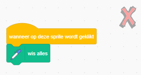
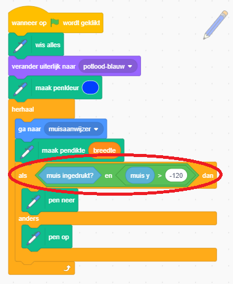

## Fouten maken

Soms maak je fouten, dus laten we een knop 'wissen' en een gum toevoegen.

+ Voeg de sprite 'X-block' toe - je vindt het in de bibliotheek, in het gedeelte met letters. Kleur het uiterlijk rood. Dit wordt de knop 'alles wissen'.


+ Voeg code aan deze sprite toe om het speelveld te wissen als erop geklikt wordt.



Merk op dat je geen bericht hoeft te sturen om het speelveld te wissen, je kunt gewoon het wis alles-blok voor deze sprite gebruiken.

Je hebt waarschijnlijk gemerkt dat je potloodsprite een gum aan het uiteinde bevat:


+ Je project bevat ook een afzonderlijke gumsprite. Klik met de rechtermuisknop op deze sprite en kies 'verschijn'. Hier is hoe je speelveld eruit zou moeten zien:


+ Voeg code toe aan de gumsprite om het potlood te laten overschakelen naar een gum wanneer op de sprite wordt geklikt.


Wanneer het potlood de "gum"-boodschap ontvangt, kunt je het potloodkostuum in de gum veranderen en de potloodkleur in wit veranderen - dezelfde kleur als het podium!

+ Voeg een code toe om de gum te maken

\--- hints \--- \--- hint \--- Voeg deze code toe aan de potloodsprite: **wanneer ik signaal** **gum ontvang** **verander uiterlijk naar** gum **maak penkleur ** wit \--- /hint \--- \--- hint \--- Zo zou je code in de potloodsprite eruit moet zien:

```blocks
when I receive [eraser v]
switch costume to [eraser v]
set pen color to [#FFFFFF]
```

\--- /hint \--- \--- /hints \---

+ Test your project, to see if you can clear and erase on the stage.


There's one more problem with the pencil - you can draw anywhere on the stage, including near the selector icons!


To fix this, tell the pencil only to draw if the mouse is clicked *and* if the y-position of the mouse is greater than -120:



+ Test your project; you now shouldn't be able to draw near the selector blocks.

