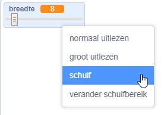
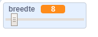

## De potlooddikte wijzigen

Vervolgens kun je code toevoegen om de persoon die jouw programma gebruikt, toe te staan om dingen te tekenen met verschillende penbreedtes.

--- task --- 

Voeg eerst een nieuwe variabele toe met de naam `breedte`{:class="block3variables"}.

[[[generic-scratch3-add-variable]]] 

--- /task ---

--- task --- 

Voeg deze regel **binnen** de `herhaal`{:class="block3control"} lus van de code van de potlood sprint toe:

```blocks3
wanneer groene vlag wordt aangeklikt
wis alles
verander uiterlijk naar (potlood-blauw v)
maak penkleur [#0035FF]
herhaal
ga naar (muisaanwijzer v)
maak pendikte (breedte :: variables)
als <<mouse down?> en <(muis y) > [-120]>> dan
pen neer
anders
pen op
end
```

--- /task ---

De pendikte wordt nu herhaaldelijk ingesteld op de waarde van de `breedte`{:class="block3variables"} variabele.

--- task --- 

Klik met de rechtermuisknop op de `breedte`{:class="block3variables"} variabele weergegeven in het speelveld en klik vervolgens op **schuif**.

 

--- /task ---

Je kunt nu de schuifregelaar onder de variabele verslepen om de waarde te wijzigen.



--- taak --- 

Test je project en kijk of je de penbreedte kunt aanpassen.

 

--- /task ---