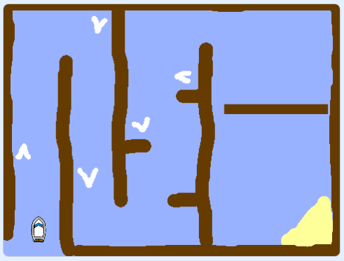

## Hoe nu verder?

Nu je het project 'Paint box' hebt voltooid, probeer eens [het 'Boot race' project](https://projects.raspberrypi.org/nl-NL/projects/boat-race?utm_source=pathway&utm_medium=whatnext&utm_campaign=projects), waarmee je een spel kunt maken waarbij je een boot om obstakels heen moet sturen.

--- no-print ---

  <iframe allowtransparency="true" width="485" height="402" src="https://scratch.mit.edu/projects/embed/276662533/?autostart=false" frameborder="0" scrolling="no"></iframe>
  

--- /no-print ---

--- print-only --- 
 
--- /print-only ---

**Door de community geleverde vertaling**

Dit project werd vertaald door **Cor Groot** en gecontroleerd door **Robert-Jan Kempenaar**.

Onze geweldige vertalers helpen ons om kinderen over de hele wereld de kans te geven te leren coderen. Jij kunt ons helpen nog meer kinderen te bereiken door onze projecten te vertalen - lees meer op [rpf.io/translators](https://rpf.io/translators).

