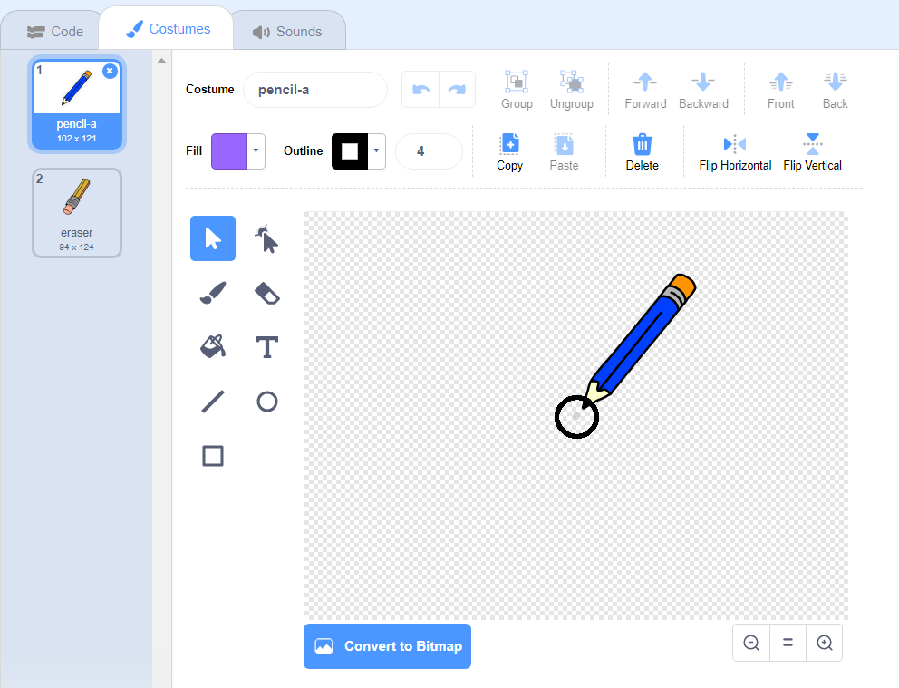

## Make a pencil

Start by making a pencil that you can use to draw on the Stage.

\--- task \--- Open the 'Paint box' Scratch starter project.

**Online**: open the starter project at [rpf.io/paint-box-on](http://rpf.io/paint-box-on){:target="_blank"}

**Offline**: otwórz projekt początkowy [ ](http://rpf.io/p/en/paint-box-go) {:target="_ blank"} w edytorze offline.

Jeśli musisz pobrać i zainstalować edytor Scratcha, znajdziesz go na stronie [rpf.io/scratchoff](http://rpf.io/scratchoff){:target="_blank"}

In the starter project, you should see pencil and eraser sprites:

 \--- /task \---

\--- task \---

Add the Pen extension to your project.

[[[generic-scratch3-add-pen-extension]]]

\--- /task \---

\--- task \---

Add some code to the pencil sprite to make the sprite follow the mouse pointer `forever`{:class="block3control"} so that you can draw:


```blocks3
po kliknięciu flagi
zawsze
  przejdź do (wskaźnik myszy v)
koniec
```

\--- /task \---

\--- task \--- Click the flag and then move the mouse pointer around the Stage to test whether your code works. \--- /task \---

Next, make your pencil only draw `if`{:class="block3control"} the mouse button is being clicked.

\--- task \--- Add this code to your pencil sprite:


```blocks3
when flag clicked
forever
  go to (mouse pointer v)

+ if <mouse down?> then
  pen down
  else
  pen up
end
```

\--- /task \---

\--- task \--- Test your code again. This time, move the pencil around the Stage and hold down the mouse button. Czy potrafisz rysować Twoim ołówkiem?

 \--- /task \---

## \--- collapse \---

## title: Does your pencil not draw from its tip?

If the line your pencil draw looks like it is coming from the pencil's middle, you need to change your pencil sprite's so the tip is the sprite's centre.

Click on the pencil sprite, and then click on the **Costumes** tab.

Move the costume's so the tip of the pencil is **just above** the centre.



Teraz przesuń ołówek na stole montażowym i rysuj. The pencil should now draw a line from its tip.

\--- /collapse \---