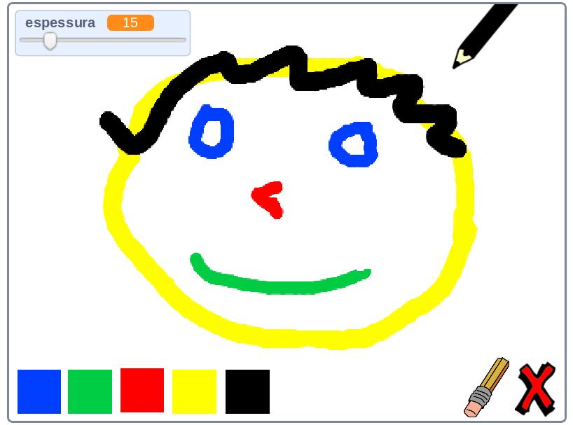

\--- no-print \---

Esta é a versão **Scratch 3** do projeto. Há também uma [versão Scratch 2 do projeto](https://projects.raspberrypi.org/en/projects/paint-box-scratch2).

\--- /no-print \---

## Introdução

Faça o seu próprio programa de pintura!

### O que você vai fazer

\--- no-print \---

Clique na bandeira verde para começar. Use o mouse para mover o lápis e segure o botão esquerdo do mouse para desenhar. Clique em uma cor para mudar de lápis. Clique na borracha para mudar para ela e usa-a para apagar o seu trabalho. Para limpar a página, clique na cruz.

  <iframe allowtransparency="true" width="485" height="402" src="//scratch.mit.edu/projects/embed/267243161/?autostart=false" frameborder="0" scrolling="no"></iframe>
  

\--- /no-print \---

\--- print-only \---

Você vai clicar na bandeira verde para começar, e vai usar o mouse para mover o lápis e manter pressionado o botão esquerdo do mouse para desenhar. Clicar em uma cor vai mudar as cores do lápis, e clicar na borracha irá mudar para a borracha!

\--- /print-only \---

## \--- collapse \---

## title: O que você vai aprender

+ Adicionar a extensão da caneta no Scratch
+ Usar transmissões para controlar um sprite no Scratch
+ Lembre-se de como responder a eventos do mouse no Scratch

\--- /collapse \---

## \--- collapse \---

## title: O que você vai precisar

### Hardware

+ Um computador capaz de executar o Scratch 3

### Software

+ Scratch 3 ([online](http://rpf.io/scratchon){:target="_blank"} ou [offline](http://rpf.io/scratchoff){:target="_blank"})

### Downloads

+ [Projeto inicial offline](http://rpf.io/p/en/paint-box-go){:target="_blank"}

\--- /collapse \---

## \--- collapse \---

## informações adicionais para educadores

Se você precisar imprimir este projeto, por favor, use a [versão para impressão](https://projects.raspberrypi.org/en/projects/paint-box/print){:target="_blank"}.

Você pode encontrar o [projeto concluído aqui](http://rpf.io/p/en/paint-box-get){:target="_blank"}.

\--- /collapse \---