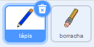
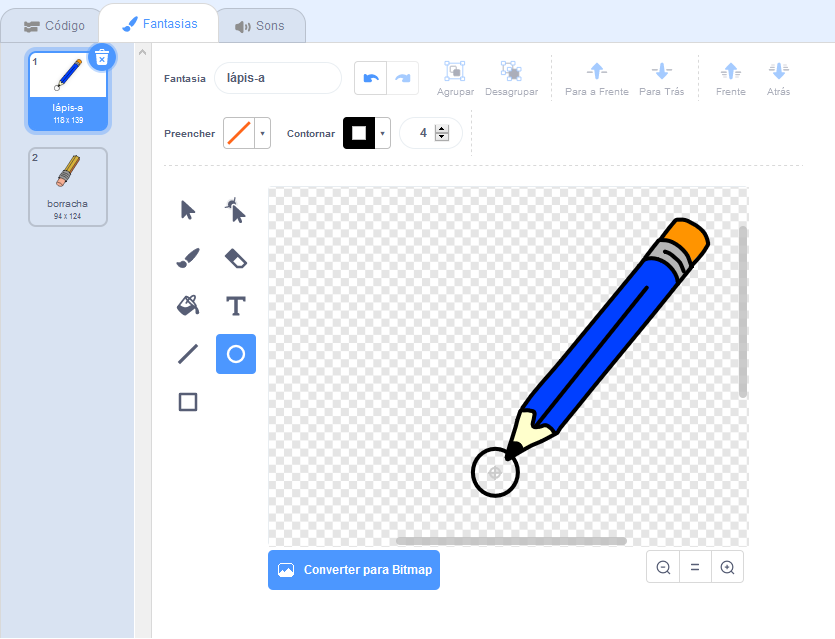

## Criar um lápis

Comece criando um lápis que você pode usar para desenhar no palco.

\--- task \---

Abre o projeto inicial 'Caixa de Pintura' em Scratch.

**Online**: open the starter project at [rpf.io/paint-box-on](https://rpf.io/paint-box-on){:target="_blank"}

Se você tiver uma conta do Scratch, pode fazer uma cópia clicando em ** Remix **.

**Offline**: open the [starter project](https://rpf.io/p/en/paint-box-go){:target="_blank"} in the offline editor.

If you need to download and install the Scratch offline editor, you can find it at [rpf.io/scratchoff](https://rpf.io/scratchoff){:target="_blank"}

No projeto inicial, você deve ver os atores lápis e borracha:



\--- /task \---

\--- task \---

Adicione a extensão Caneta ao seu projeto.

[[[generic-scratch3-add-pen-extension]]]

\--- /task \---

\--- task \---

Adicione algum código ao ator lápis para que ele siga o mouse `sempre`{:class="block3control"} para que você possa desenhar:


```blocks3
when flag clicked
forever
  go to (mouse pointer v)
end
```

\--- /task \---

\--- task \---

Clique na bandeira então mova o ponteiro do mouse no Palco para testar se seu código funciona.

\--- /task \---

Em seguida, faça seu lápis desenhar apenas `se`{:class="block3control"} o botão do mouse está sendo clicado.

\--- task \---

Adicione este código ao seu pincel (ator):


```blocks3
when flag clicked
forever
  go to (mouse pointer v)

+ if <mouse down?> then
  pen down
  else
  pen up
end
```

\--- /task \---

\--- task \---

Teste seu código novamente. Dessa vez, mova o lápis pelo palco e mantenha pressionado o botão do mouse. Você consegue desenhar com o seu lápis?


\--- /task \---

## \--- collapse \---

## title: O seu lápis não desenha pela ponta?

Se a linha que seu lápis desenha parece que está vindo do meio do lápis, você precisa mudar seu ator de lápis para que a ponta seja o centro do ator.

Clique no ator lápis e em seguida, clique na aba **Fantasias**.

Mova a fantasia para que a ponta do lápis seja **logo acima** do centro.



Agora mova o lápis no Palco e desenhe. O lápis agora deve desenhar uma linha a partir da ponta.

\--- /collapse \---