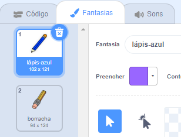
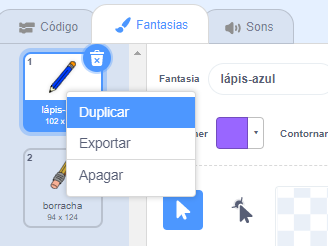
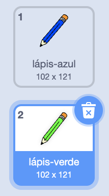
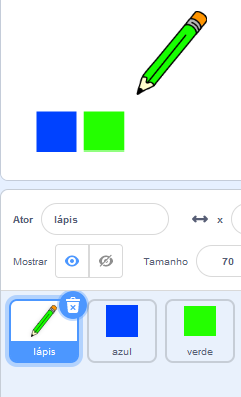

## Lápis coloridos

Agora vamos adicionar lápis de cores diferentes ao seu projeto e permitir que o usuário escolha entre eles.

\--- task \---

Clique na aba Fantasias do ator 'lápis'.

Renomeie a fantasia `lápis-a` para `lápis-azul`



\--- /task \---

\--- task \--- Clique no ator quadrado azul e adicione este código:

Clique com o botão direito na fantasia azul-lápis e selecione **duplicado**.



\--- /task \---

\--- task \---

Nomeie a nova fantasia 'verde-lápis' e pinte-o de verde-lápis.



\--- /task \---

\--- task \---

\--- task \--- Desenhe dois novos atores: um quadrado azul e um quadrado verde. Estes são para escolher entre o lápis azul e o verde.



\--- /task \---

\--- task \---

Renomeie os novos atores cpara que sejam chamados de 'azul' e 'verde'

Depois, faça o mesmo para mudar a cor do lápis para azul.

\--- /task \---

\--- task \---

Adicione algum código ao ator 'verde' para que quando este ator for clicado, ele `transmita`{: class = "block3events"} a mensagem "verde".


```blocks3
quando este ator for clicado
transmita (verde v)
```

\--- task \--- Por fim, adicione este código para informar ao ator do lápis qual cor começar e para garantir que a tela esteja limpa quando o programa for iniciado.

\--- /task \---

O ator lápis deve ouvir a mensagem "verde", mudar sua fantasia e cor do lápis em resposta.

Se preferir, você pode começar com um lápis de cor diferente.

\--- task \--- Mude para o seu ator lápis. Adicione algum código para que quando este ator receba a transmissão `verde`{:class="blockevents"}, ele mude para a fantasia de lápis verde e a cor do lápis para verde.


```blocks3
quando eu receber [verde v]
mude para a fantasia (pencil-green v)
mude a cor da caneta para [#00CC44]
```

Para definir a cor do lápis como verde, clique no quadrado colorido no bloco `definir cor da caneta`{:class="block3extensions"}, e depois clique no ator quadrado verde.

\--- /task \---

Depois, faça o mesmo para mudar a cor do lápis para azul.

\--- task \---

Clique no ator quadrado azul e adicione este código:


```blocks3
quando este ator for clicado
transmita (azul v)
```

Em seguida, clique no ator lápis e adicione este código:


```blocks3
quando eu receber [azul v]
mude para a fantasia (pencil-blue v)
mude a cor da caneta para [#0000ff]
```

\--- /task \---

\--- task \---

\--- task \--- Por fim, adicione este código para informar ao ator do lápis qual cor começar e para garantir que a tela esteja limpa quando o programa for iniciado.


```blocks3
quando ⚑ for clicado
+apague tudo
+mude para a fantasia (pencil-blue v)
+mude a cor da caneta para [#0035FF]
sempre 
  vá para (mouse pointer v)
  se <mouse down?> então 
    use a caneta
  senão 
    levante a caneta
  end
end
```

\--- /task \---

Se preferir, você pode começar com um lápis de cor diferente.

\--- task \---

\--- task \--- Teste seu código. Você consegue alternar entre as cores do lápis azul e verde clicando nos quadrados azuis ou verdes?


\--- /task \---