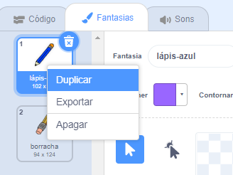
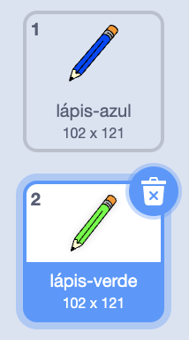

## Lápis coloridos

Vamos adicionar lápis de cor diferentes ao seu projeto e permitir que o usuário escolha entre eles.

+ Clique no seu lápis (ator), clique em 'Fantasias' e duplique sua fantasia de 'lápis azul'.



+ Renomeie seu nova fantasia como 'lápis verde' e pinte de verde o lápis.



[[[generic-scratch-rename-sprite]]]

+ Desenhe dois novos atores - um quadrado azul e um quadrado verde. Você os usará para selecionar o lápis azul ou verde.


+ Renomeie seus atores para que eles sejam chamados de "azuis" e "verdes"

+ Adicione algum código ao ator 'verde' para que quando ele for clicado, seja `transmitido`{:class="blockevents"} a mensagem "verde" para o ator lápis, dizendo para mudar a fantasia do lápis e sua cor.


[[[generic-scratch-broadcast-message]]]

+ Selecione o ator lápis. Adicione algum código para que quando este ator receber a `transmissão`{:class="blockevents"} verde, ele deve mudar para a fantasia de lápis verde e mudar a cor do lápis para verde.


To set the pencil to colour to green, click the coloured box in the `set pen color`{:class="blockpen"} block, and click on the green sprite to choose the same colour green as your pencil colour.

+ Agora você pode fazer o mesmo com o ícone do lápis azul: adicione este código ao ator quadrado azul:

```blocks
when this sprite clicked
broadcast [blue v]
```

adicione este código ao seu pincel (ator):

```blocks
when I receive [blue v]
switch costume to [pencil-blue v]
set pen color to [#0000ff]
```

+ Por fim, adicione esse código para informar ao ator lápis que cor começar a usar e verifique se a tela está clara.


Escolhemos começar com o azul, mas, se preferir, pode começar com um lápis de cor diferente.

+ Teste seu projeto. Você pode alternar entre lápis azuis e verdes clicando nos quadrados azuis ou verdes (atores)?

