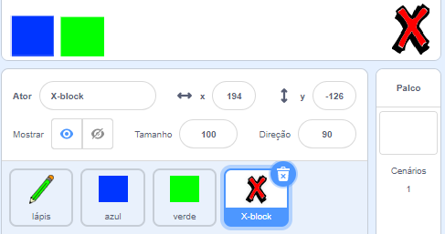
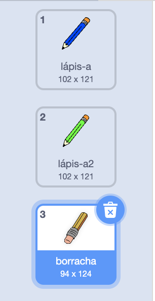
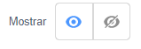

## Desfazer erros

Às vezes, erros acontecem, então vamos adicionar um botão 'limpar' e uma borracha.

--- task ---

Adicione o ator 'X-block' da seção de letras da biblioteca. Pinte a fantasia do ator de vermelho e torne-o um pouco menor. Este ator vai ser o botão 'limpar'.

[[[generic-scratch3-sprite-from-library]]]



--- /task ---

--- task ---

Adicione código ao 'bloco-X' para limpar o palco quando clicar no ator.


```blocks3
when this sprite clicked
erase all
```

--- /task ---

Você não precisa usar uma `transmissão`{:class="block3events"} para limpar o palco, porque o bloco `apagar tudo`{:class="block3extensions"} faz isso.

Você vê que o ator lápis inclui uma fantasia de borracha?



O seu projeto também inclui separadamente um ator borracha.

--- task ---

Clique neste ator de borracha e selecione **mostrar**.



Esta é a aparência que seu Palco deve ter agora:


--- /task ---

--- task ---

Adicione código ao ator borracha para enviar um `'eraser' broadcast`{:class="block3events"} quando o sprite borracha for clicado.


```blocks3
when this sprite clicked
broadcast (eraser v)
```

--- /task ---

Quando o ator lápis recebe a mensagem 'borracha', deveria trocar a fantasia para a borracha e mudar a cor do lápis para branco, que é a mesma cor do palco!

--- task ---

Adicione algum código para criar a borracha.

--- hints ---
 --- hint ---

Adicione algum código ao sprite de lápis: `Quando eu receber`{:class="block3events"} a `borracha`{:class="block3events"} mensagem `Mudar para borracha de traje`{:class="block3looks"} `Defina a cor da caneta`{:class="block3extensions"} para branco.

--- /hint --- --- hint ---

Aqui estão todos os blocos que você precisa:

```blocks3
set pen color to [#FFFFFF]
when I receive [eraser v]
switch costume to (eraser v)
```

--- /hint --- --- hint ---

É assim que seu código deve estar:


```blocks3
when I receive [eraser v]
switch costume to (eraser v)
set pen color to [#FFFFFF]
```

--- /hint ------ /hints --- --- /task ---

--- task ---

Teste seu projeto para ver se você consegue limpar o Palco e apagar as linhas do lápis.


--- /task ---

Há mais um problema com o lápis: você pode desenhar em qualquer lugar do Palco, inclusive próximo aos botões 'limpar' e borracha!


--- task ---

Para corrigir isso, altere o código para que a caneta fique para baixo somente se o mouse for clicado em **e** a posição `y` do ponteiro do mouse é maior que `-120`:


```blocks3
when flag clicked
erase all
switch costume to (pencil-blue v)
set pen color to [#0035FF]
forever
  go to (mouse pointer v)
+if <<mouse down?> and <(mouse y) > [-120]>> then 
  pen down
  else
  pen up
end
```

--- /task ---

--- task ---

Teste seu projeto. Agora você não deve conseguir desenhar perto dos botões.


--- /task ---