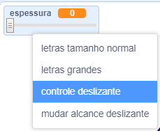

## Mude a espessura do lápis

Em seguida, você adicionará código para permitir que a pessoa usando o seu programa desenhe coisas com diferentes larguras de caneta.

\--- task \---

Primeiro, adicione uma nova variável chamada `espessura`{:class="block3variables"}.

[[[generic-scratch3-add-variable]]]

\--- /task \---

\--- task \---

Adicione esta linha **dentro** do loop `sempre`{:class="block3control"} do código do ator lápis:

```blocks3
when flag clicked
erase all
switch costume to (pencil-blue v)
set pen color to [#0035FF]
forever
go to (mouse pointer v)
+set pen size to (width :: variables)
if <<mouse down?> and <(mouse y) > [-120]>> then 
  pen down
  else
  pen up
end
```

\--- /task \---

A espessura da da caneta agora é ajustada repetidamente pra o valor da variável `espessura`{:class="block3variables"}.

\--- task \---

Clique com o botão direito na variável `largura`{:class="block3variables"} visível no Palco, e depois clique no **controle deslizante**.



\--- /task \---

Agora você pode arrastar o controle deslizante que está visível abaixo da variável para alterar o seu valor.


\--- task \---

Teste seu projeto e veja se você consegue mudar a largura da caneta.


\--- /task \---