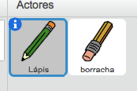

## Criar um lápis

Vamos começar por criar um lápis que possa ser usado para desenhar no palco.

\--- task \---

Open the 'Paint box' Scratch starter project.

**Online:** abre o projeto Scratch inicial em [rpf.io/paint-box-on](http://rpf.io/paint-box-on){:target="_blank"}

Se tiveres uma 'conta Scratch' podes fazer uma cópia ao clicares **Remix**.

**Offline**: Abre o [projecto inicial](http://rpf.io/p/en/paint-box-go){:target="_blank"} no editor offline.

Se precisares de descarregar e instalar o editor offline do Scratch, podes encontrá-lo em [rpf.io/scratchoff](http://rpf.io/scratchoff){:target="_blank"}

No projeto inicial, você deve ver os atores lápis e borracha:



\--- /task \---

\--- task \---

Adiciona a extensão de caneta ao teu projeto.

[[[generic-scratch3-add-pen-extension]]]

\--- /task \---

\--- task \---

Adiciona código ao actor lápis para que ele siga o rato ` para sempre ` {: class = "blockcontrol"} para que possas desenhar:


```blocks3
quando alguém clicar na bandeira verde
repete para sempre 
  vai para (mouse pointer v)
end
```

\--- /task \---

\--- task \---

Click the flag and then move the mouse pointer around the Stage to test whether your code works.

\--- /task \---

Agora, vamos fazer o teu lápis apenas desenhar ` se ` {: class = "blockcontrol"} o rato for clicado.

\--- task \---

Adiciona este código ao teu actor lápis:


```blocks3
quando alguém clicar na bandeira verde
repete para sempre 
  vai para (mouse pointer v)
  + se <o botão do rato está pressionado>, então 
  +   baixa a tua caneta
  + senão, 
  +   levanta a tua caneta
  + end
end
```

\--- /task \---

\--- task \---

Testa o teu código outra vez. Desta vez, move o lápis ao redor do palco enquanto clicas o botão do rato. Consegues desenhar com o teu lápis?


\--- /task \---

## \--- collapse \---

## title: O teu lápis não desenha com a ponta?

Se a linha que o teu lápis desenha parecer vir do meio do lápis, vais ter que alterar o ator lápis para que a ponta seja o centro do ator.

Clica no ator lápis e a seguir clica na aba dos ** Trajes **.

Move a roupa para que a ponta do lápis fique ** logo acima ** do Centro.


Agora move o lápis no Palco e desenha. O lápis deve agora desenhar uma linha a partir da ponta.

\--- /collapse \---