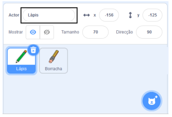
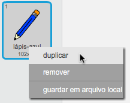
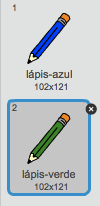
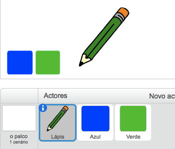

## Lápis coloridos

Vamos adicionar lápis de cor diferentes ao teu projeto e permitir ao utilizador escolher entre eles.

\--- tarefa \--- Renomeia o ator ` lápis ` como ` lápis-azul `

 \--- /task \---

\--- task \--- Clica com o botão direito do rato no ator lápis e duplica o traje de 'lápis azul'.

 \--- /task \---

\--- task \--- Renomeia o teu novo traje para 'lápis-verde' e pinta o lápis de verde.



\--- /task \---

\--- task \--- Desenha dois novos actores - um quadrado azul e um quadrado verde. Estes atores vão ser usados para escolher entre o lápis azul e o verde.

 \--- /task \---

\--- task \--- Renomeia os teus actores para que sejam chamados de "azul" e "verde"

[[[generic-scratch3-rename-sprite]]]

\--- /task \---

\--- task \--- Adiciona código ao actor vermelho para que, quando o actor for clicado, ele `difunda a mensagem`{:class="block3events"} 'vermelho' ao personagem actor".


```blocks3
quando alguém clicar em ti
difunde a mensagem (green v)
```

[[[generic-scratch3-broadcast-message]]] \--- /task \---

O ator lápis deve ouvir a mensagem "verde" e mudar o seu traje e cor do lápis em resposta.

\--- task \--- Muda para o teu actor lápis. Acrescenta-lhe código para que quando este actor receber a mensagem` verde ` {: class = "blockevents"}, ele mude para o traje de lápis verde e mude a cor da caneta para verde.


```blocks3
quando receberes a mensagem [green v]
muda o teu traje para (pencil-green v)
altera a cor da tua caneta para [#00CC44]
```

Para definir o lápis como verde, clicano quadrado colorido em ` definir cor da caneta ` {: class = "block3extensions"} e clica no ator quadrado verde. \--- /task \---

Depois, faz o mesmo para mudar a cor do lápis para azul.

\--- task \--- Clica no ator quadrado azul e adiciona este código:


```blocks3
quando alguém clicar em ti
difunde a mensagem (azul v)
```

A seguir, clica no lápis e adiciona este código: 

```blocks3
quando receberes a mensagem [blue v]
muda o teu traje para (pencil-blue v)
altera a cor da tua caneta para [#0000ff]
```

\--- /task \---

\--- task \--- Finally, add this code to tell the pencil sprite which colour to start with, and to make sure that the screen is clear when your program starts.


```blocks3
when flag clicked
+erase all
+switch costume to (pencil-blue v)
+set pen color to [#0035FF]
forever
  go to (mouse pointer v)
if <mouse down?> then
  pen down
  else
  pen up
end
```

\--- /task \---

If you prefer, you can start with a different colour pencil.

\--- task \--- Test your code. Can you switch between the blue and green pencil colours by clicking on the blue or green square sprites?

 \--- /task \---