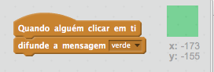
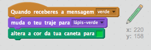
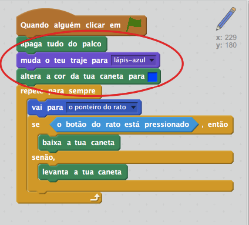

## Lápis coloridos

Vamos adicionar lápis de cor diferentes ao teu projeto e permitir ao utilizador escolher entre eles.

+ Clica no teu actor 'lápis', clica em 'Trajes' e duplica o teu traje de 'lápis-azul'.


+ Renomeia o teu novo traje para 'lápis-verde' e pinta o lápis de verde.


[[[generic-scratch-rename-sprite]]]

+ Desenha dois novos actores - um quadrado azul e um quadrado verde. Vais usá-los para selecionar o lápis azul ou verde.


+ Renomeia os teus actores para que eles sejam chamados de "azul" e "verde"

+ Adiciona algum código ao actor 'verde' para que quando ele for clicado, seja ` difundida a mensagem` {: class = "blockevents"} "verde" para o actor lápis, dizendo-lhe para mudar as cores de traje e lápis.



[[[generic-scratch-broadcast-message]]]

+ Muda para o teu actor de lápis. Adiciona código para que quando este actor receber a `difusão da mensagem ` {: class = "blockevents"} verde, ele mude para o traje de lápis verde e mude a cor da caneta para verde.



Para definir o lápis de cor para verde, clica na caixa colorida no bloco ` altera a cor da tua caneta para ` {: class = "blockpen"}, e clica no actor verde para escolher a mesma cor verde como a cor do teu lápis.

+ Podes agora fazer o mesmo com o ícone do lápis azul: adiciona este código ao actor quadrado azul:

```blocks
quando alguém clicar em ti
difunde a mensagem [azul v]
```

... e adiciona este código ao actor lápis:

```blocks
when I receive [blue v]
switch costume to [pencil-blue v]
set pen color to [#0000ff]
```

+ Finally, add this code to tell the pencil sprite which colour to start with, and make sure that the screen is clear.



We chose to start with blue but if you prefer, you can start with a different colour pencil.

+ Test out your project. Can you switch between blue and green pens by clicking on the blue or green square sprites?

