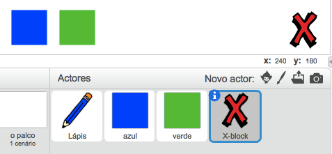
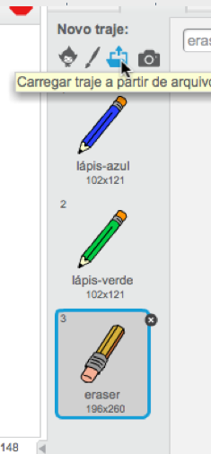

## Desfazer erros

Às vezes acontecem erros, vamos então adicionar um botão 'limpar' e uma borracha.

\--- task \---

Adiciona o ator 'X-block' a partir da secção de cartas da biblioteca. Pinta o traje do ator de vermelho e torna-o um pouco menor. Este actor vai ser o botão 'limpar'.

[[[generic-scratch3-sprite-from-library]]]



\--- /task \---

\--- task \---

Adiciona código ao ator 'X-block' para limpar o palco quando o ator for clicado.


```blocks3
quando alguém clicar em ti
apaga tudo do palco
```

\--- /task \---

Não necessitas de usar uma mensagem ` ` {: class = "block3events"} para limpar o palco, porque o bloco ` apaga tudo ` {: class = "block3extensions"} faz esse trabalho.

Estás a ver que o ator lápis inclui um traje de borracha?



O teu projeto também inclui separadamente um actor borracha.

\--- task \---

Click on this eraser sprite and then select **show**.


Here is how your Stage should look now:


\--- /task \---

\--- task \---

Add code to the eraser sprite to send an `'eraser' broadcast`{:class="block3events"} when the eraser sprite is clicked.


```blocks3
quando alguém clicar em ti
difunde a mensagem (eraser v)
```

\--- /task \---

When the pencil sprite receives the 'eraser' message, it should switch its costume to the eraser and switch the pen colour to white, which is the same colour as the Stage!

\--- task \---

Add some code to create the eraser.

\--- hints \--- \--- hint \---

Add some code to the pencil sprite: `When I receive`{:class="block3events"} the `eraser`{:class="block3events"} message `Switch to costume eraser`{:class="block3looks"} `Set pen color`{:class="block3extensions"} to white

\--- /hint \--- \--- hint \---

Here are all the blocks you need:

```blocks3
altera a cor da tua caneta para [#FFFFFF]

Quando receberes a mensagem [eraser v]

muda o teu traje para (eraser v)
```

\--- /hint \--- \--- hint \---

Here is what the code should look like:


```blocks3
quando receberes a mensagem [eraser v]
muda o teu traje para (eraser v)
altera a cor da tua caneta para [#FFFFFF]
```

\--- /hint \--- \--- /hints \--- \--- /task \---

\--- task \---

Test your project to see if you can clear the Stage and erase pencil lines.


\--- /task \---

There's one more problem with the pencil: you can draw anywhere on the Stage, including near the 'clear' and eraser buttons!


\--- task \---

To fix this, change the code so that the pen is only down if the mouse is clicked **and** the `y` position of the mouse pointer is greater than `-120`:


```blocks3
quando alguém clicar na bandeira verde
apaga tudo do palco
muda o teu traje para (pencil-blue v)
altera a cor da tua caneta para [#0035FF]
repete para sempre 
  vai para (mouse pointer v)
  + se <<o botão do rato está pressionado> e <(o y da posição do rato) > [-120]>>, então 
  +   baixa a tua caneta
  + senão, 
  +   levanta a tua caneta
  + end
end
```

\--- /task \---

\--- task \---

Test your project. You now should not be able to draw near the buttons.


\--- /task \---