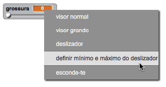

## Mudar a grossura do lápis

Vamos permitir que o utilizador desenhe usando uma variedade de tamanhos de lápis diferentes.

+ Primeiro, adiciona uma nova variável chamada `grossura` {: class = "blockvariable"}.

[[[generic-scratch-add-variable]]]

+ Adiciona esta linha * dentro * do bloco` repete para sempre ` {: class = "blockcontrol"} do código do lápis:

```blocks
    altera a espessura da tua caneta para (grossura)
```

A grossura do lápis será agora definida repetidamente para o valor da variável 'grossura'.

+ Clica com o botão direito do rato na tela da variável no palco e clica em 'deslizador'.


Agora podes arrastar o controle deslizante abaixo da variável para alterar o seu valor.


+ Testa o teu projeto e vê se podes modificar a grossura do lápis.


Se preferires, podes definir o valor mínimo e máximo de 'grossura' permitido. Para isso, clica novamente com o botão direito na variável e clica em 'definir mínimo e máximo do deslizador'. Set the minimum and maximum values of your variable to something more sensible, like 1 and 20.



Keep testing your 'width' variable until you're happy.