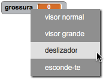
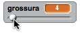

## Alterar a largura da caneta

Agora, vais acrescentar código para permitir que a pessoa que usa seu programa desenhe objetos com diferentes larguras de caneta.

\--- task \---

Primeiro, adiciona uma nova variável chamada `grossura` {: class = "blockvariable"}.

[[[generic-scratch3-add-variable]]]

\--- /task \---

\--- task \---

Adiciona esta linha ** dentro ** do bloco` repete para sempre ` {: class = "blockcontrol"} no código do lápis:

```blocks3
quando alguém clicar na bandeira verde
apaga tudo do palco
muda o teu traje para (pencil-blue v)
altera a cor da tua caneta para [#0035FF]
repete para sempre 
  vai para (mouse pointer v)
  + altera a espessura da tua caneta para (width :: variables)
  se <<o botão do rato está pressionado> e <(o y da posição do rato) > [-120]>> , então 
    baixa a tua caneta
  senão, 
    levanta a tua caneta
  end
end
```

\--- /task \---

A largura da caneta é agora definida repetidamente para o valor da variável ` largura ` {: class = "block3variables"}.

\--- task \---

Clica com o botão direito do rato na variável ` largura ` {: class = "block3variables"} exibida no palco e, a seguir clica no ** barra deslizante **.



\--- /task \---

Agora já podes arrastar a barra deslizante que está por baixo do indicador da variável para alterar o seu valor.



\--- task \---

Testa o teu projeto e vê se consegues acrescentar código para ajustar a largura da caneta.


\--- /task \---