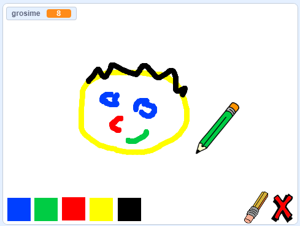

\--- no-print \---

Aceasta este versiunea **Scratch 3** a proiectului. Există, de asemenea, o versiune de [Scratch 2 a proiectului](https://projects.raspberrypi.org/en/projects/paint-box-scratch2).

\--- /no-print \---

## Introducere

Creează-ți propriul program de desenat!

### Ce vei face

\--- no-print \--- Dă click pe stegulețul verde pentru a începe. Folosește mouse-ul pentru a mișca creionul, iar apoi ține apăsat butonul stâng al mouse-ului pentru a desena. Dă click pe o culoare pentru a schimba creionul. Dă click pe radieră pentru a o activa, și folosește-o pentru a-ți șterge desenul. Pentru a goli pagina, dă click pe X.

  <iframe allowtransparency="true" width="485" height="402" src="//scratch.mit.edu/projects/embed/267243161/?autostart=false" frameborder="0" scrolling="no"></iframe>
  

\--- /no-print \---

\--- print-only \--- Pentru a începe vei da click pe stegulețul verde, apoi vei folosi mouse-ul pentru a mișca creionul și vei ține apăsat butonul stâng al mouse-ului pentru a desena. Dând click pe o culoare vei schimba culoarea creionului, și dând click pe radieră vei activa radiera!

 \--- /print-only \---

## \--- collapse \---

## title: Ce vei învăța

+ Adaugă în Scratch extensia pentru creion
+ Use broadcasts to control a sprite in Scratch
+ Recall how to respond to mouse events in Scratch \--- /collapse \---

## \--- collapse \---

## title: What you will need

### Hardware

+ A computer capable of running Scratch 3

### Software

+ Scratch 3 (either [online](http://rpf.io/scratchon){:target="_blank"} or [offline](http://rpf.io/scratchoff){:target="_blank"})

### Downloads

+ [Offline starter project](http://rpf.io/p/en/paint-box-go){:target="_blank"}

\--- /collapse \---

## \--- collapse \---

## title: Additional information for educators

If you need to print this project, please use the [printer-friendly version](https://projects.raspberrypi.org/en/projects/paint-box/print){:target="_blank"}.

You can find the [completed project here](http://rpf.io/p/en/paint-box-get){:target="_blank"}. \--- /collapse \---