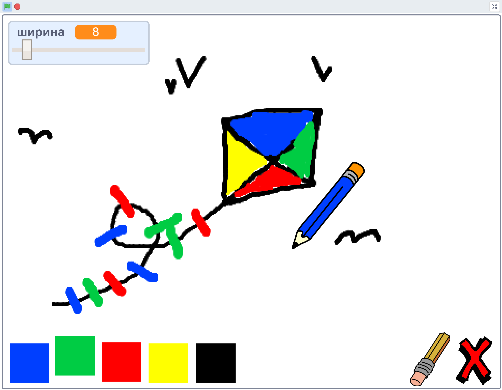
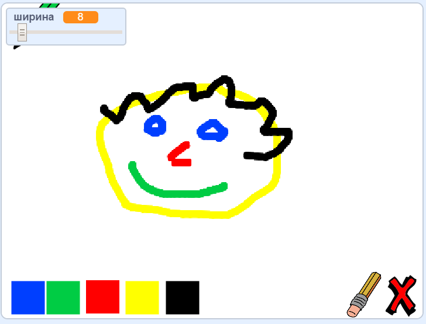

\--- нет печати \---

Это **Scratch 3** версия проекта. Существует также [версия Царапины 2 проекта](https://projects.raspberrypi.org/en/projects/paint-box-scratch2).

\--- / без печати \---

## Введение

Сделайте свою собственную программу рисования!

### Что вы сделаете

\--- no-print \--- Нажмите на зеленый флаг, чтобы начать. Используйте мышь, чтобы переместить карандаш, и удерживайте левую кнопку мыши, чтобы нарисовать. Нажмите на цвет, чтобы изменить карандаши. Нажмите на ластик, чтобы перейти к нему, и используйте его, чтобы стереть свою работу. Чтобы очистить страницу, нажмите на крестик.

  <iframe allowtransparency="true" width="485" height="402" src="//scratch.mit.edu/projects/embed/267243161/?autostart=false" frameborder="0" scrolling="no"></iframe>
  

\--- / без печати \---

\--- print-only \--- Вы нажмете на зеленый флаг, чтобы начать, и вы будете использовать мышь, чтобы переместить карандаш, и удерживайте левую кнопку мыши, чтобы рисовать. Нажатие на цвет изменит цвет карандаша, а нажатие на ластик превратится в ластик!

 \--- / только для печати \---

## \--- свернуть \---

## title: Что вы выучите

+ Как использовать расширение Pen в Scratch
+ Как использовать трансляции для общения между спрайтами
+ Как обнаружить события мыши \--- / свернуть \---

## \--- свернуть \---

## название: что вам нужно

### аппаратные средства

+ Компьютер с поддержкой Scratch 3

### Программного обеспечения

+ Царапина 3 (либо [онлайн](http://rpf.io/scratchon){: target = "_ blank"} или [offline](http://rpf.io/scratchoff){: target = "_ blank"})

### Загрузки

+ [Автономный стартовый проект](http://rpf.io/p/en/paint-box-go){: target = "_ blank"}

\--- / свернуть \---

## \--- свернуть \---

## title: Дополнительная информация для педагогов

Если вам нужно распечатать этот проект, пожалуйста , используйте [Версия для печати](https://projects.raspberrypi.org/en/projects/paint-box/print){: TARGET = «_blank»}.

Вы можете найти [решение для этого проекта здесь](http://rpf.io/p/en/paint-box-get){: target = "_ blank"}. \--- / свернуть \---