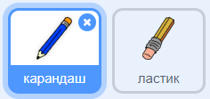
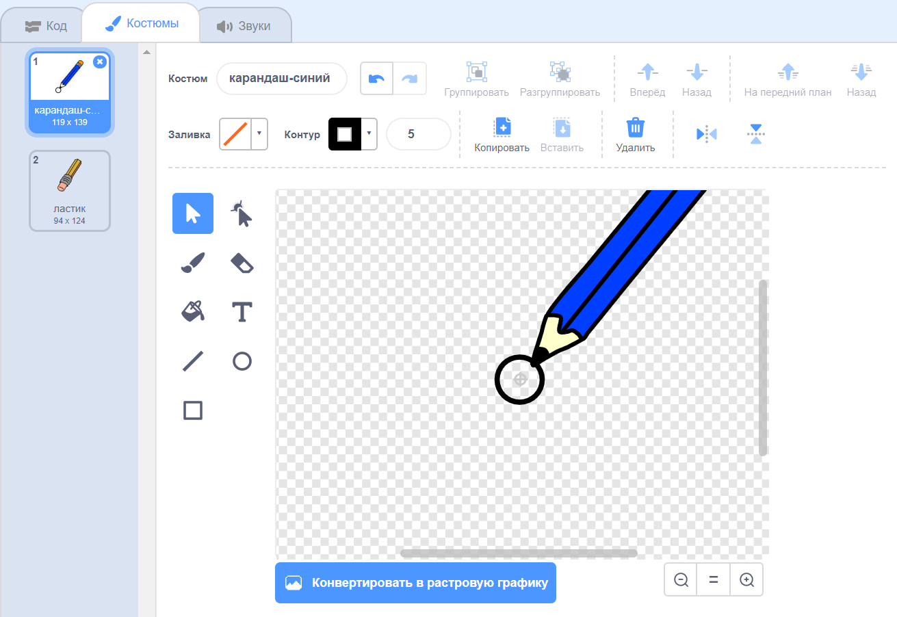

## Сделай карандаш

Начни с создания карандаша, который можно будет использовать для рисования на сцене.

--- task --- Открой стартовый проект «Коробка для рисования».

**Онлайн**: открой стартовый проект по адресу [scratch.mit.edu/projects/354196728](https://scratch.mit.edu/projects/354196728){:target="_blank"}

Если у тебя есть учетная запись Скретч, ты можешь сделать копию, нажав **Ремикс**.

**Оффлайн**: открой [стартовый проект](https://rpf.io/p/ru-RU/paint-box-go){:target="_blank"} в оффлайн-редакторе.

Если тебе нужно скачать и установить оффлайн-редактор Скретч, ты сможешь найти его по адресу [rpf.io/scratchoff](https://rpf.io/scratchoff){:target="_blank"}

В стартовом проекте ты должен увидеть спрайты карандаша и ластика:

 --- /task ---

--- task ---

Добавь расширение пера в твой проект.

[[[generic-scratch3-add-pen-extension]]]

--- /task ---

--- task ---

Добавь код в спрайт карандаша, чтобы спрайт следовал указателю мыши `всегда`{:class="block3control"} для того, чтобы можно было рисовать:


```blocks3
когда щёлкнут по зелёному флагу
повторять всегда 
  перейти на (указатель мыши v)
end
```

--- /task ---

--- task --- Нажми на флаг, а затем перемещай указатель мыши по рабочей области, чтобы проверить, работает ли твой код. --- /task ---

Далее, сделай так, чтобы карандаш рисовал только `если`{:class="block3control"} кнопка мыши нажата.

--- task --- Добавь этот код в твой спрайт карандаша:


```blocks3
когда щёлкнут по зелёному флагу
повторять всегда 
  перейти на (указатель мыши v)
+ если <мышь нажата?> , то 
  опустить перо
  иначе 
  поднять перо
  end
end
```

--- /task ---

--- task --- Проверь свой код снова. На этот раз перемещай карандаш вокруг рабочей области, удерживая кнопку мыши. Ты можешь рисовать своим карандашом?

 --- /task ---

--- collapse ---
---
title: Ваш карандаш рисует не из своего кончика?
---

Если линия, которую рисует карандаш, выглядит так, будто она идёт от середины карандаша, тебе нужно изменить спрайт карандаша так, чтобы кончик стал центром спрайта.

Нажми на спрайт карандаша, а затем нажми на вкладку **Костюмы**.

Перемести костюм так, чтобы кончик карандаша был **чуть выше** центра.



Теперь перемещай карандаш вокруг сцены и рисуй. В этот раз карандаш должен рисовать линию из своего кончика.

--- /collapse ---
