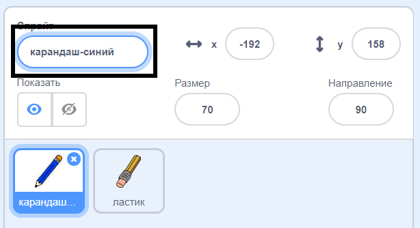
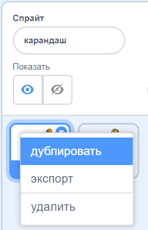
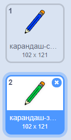
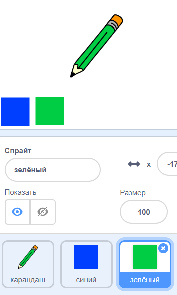

## Цветные карандаши

Теперь мы поможем тебе добавить разные цветные карандаши в твой проект так, чтобы пользователи могли выбирать между ними.

\--- task \--- Поменяй имя спрайта `карандаш` на `карандаш-синий`

 \--- /task \---

\--- task \--- Щелкни правой кнопкой мыши на спрайте карандаша и продублируй костюм «карандаш-синий».

 \--- /task \---

\--- task \--- Назови новый костюм «карандаш-зеленый» и раскрась карандаш в зеленый.



\--- /task \---

\--- task \--- Нарисуй два новых спрайта: один синий квадрат и один зеленый квадрат. Они сделаны для выбора между синим и зеленым карандашами.

 \--- /task \---

\--- task \--- Переименуй новые спрайты, чтобы они назывались «синий» и «зеленый»

[[[generic-scratch3-rename-sprite]]]

\--- /task \---

\--- task \--- Добавь код в «зеленый» спрайт, чтобы когда его нажимали, он `транслировал`{:class="block3events"} сообщение «зеленый».


```blocks3
когда спрайт нажат
передать (зеленый v)
```

[[[generic-scratch3-broadcast-message]]] \--- /task \---

Спрайт карандаша должен ожидать сообщение «зеленый» и изменить его костюм и цвет карандаша в ответ.

\--- task \--- Переключись на спрайт твоего карандаша. Добавь код, чтобы при получении сообщения `зелёный`{:class="block3events"} спрайт переключался на зелёный костюм карандаша и менял цвет карандаша на зелёный.


```blocks3
когда я получу [зеленый v]
изменить костюм на (карандаш-зеленый v)
установить цвет пера [#00CC44]
```

Чтобы поменять цвет карандаша на зелёный, нажми на цветной квадрат в блоке `установить для пера цвет`{:class="block3extensions"}, а затем нажми на зелёный квадратный спрайт. \--- /task \---

Сделай то же самое для синего цвета, чтобы можно было поменять цвет и на синий.

\--- task \--- Нажми на спрайт синего квадрата и добавь этот код:


```blocks3
когда спрайт нажат
передать (синий v)
```

Затем нажми на спрайт карандаша и добавь этот код: 

```blocks3
когда я получу [синий v]
изменить костюм на (карандаш-синий v)
установить цвет пера [#0000ff]
```

\--- /task \---

\--- task \--- Наконец, добавьте этот код, чтобы указать спрайту карандаша, с какого цвета начинать и чтобы экран был чист при запуске вашей программы.


```blocks3
когда flag нажат
+стереть всё
+изменить костюм на (карандаш-синий v)
+установить для пера цвет [#0035FF]
повторять всегда
  перейти на (указатель мыши v)
если <mouse down?>, то
  опустить перо
  иначе
  поднять перо
end
```

\--- /task \---

Если ты хочешь, ты можешь начать с другого цветного карандаша.

\--- task \--- Проверь свой код. Можешь ли ты переключиться между синим и зеленым карандашом, нажимая на синий или зеленый квадрат?

 \--- /task \---