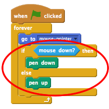

## Изготовление карандаша

Начнем с создания карандаша, который можно использовать для рисования на сцене.

+ Откройте проект «Paintbox» Scratch онлайн по адресу [jumpto.cc/paint-go](http://jumpto.cc/paint-go){: target = "_ blank"} или загрузите с <http://jumpto.cc/paint-get>{: target = "_ blank"} и затем откройте его, если вы используете автономный редактор.

Вы увидите спрайты карандашом и ластиком:


+ Добавьте код в карандашный спрайт, чтобы он следил за мышью `навсегда`{: class = "blockcontrol"}, чтобы вы могли рисовать:

```blocks
    когда флаг щелкнул
    навсегда
      перейдите к [указателю мыши v]
    end
```

+ Нажмите флаг, а затем переместите мышь вокруг сцены, чтобы проверить, работает ли код.

Затем давайте сделаем ваш карандаш только рисованием `если`{: class = "blockcontrol"} щелкнули мышь.

+ Добавьте этот код в свой карандашный спрайт:



+ Проверьте свой код еще раз. На этот раз переместите карандаш вокруг сцены и нажмите и удерживайте кнопку мыши. Вы можете рисовать карандашом?


## \--- коллапс \---

## title: Если у вас проблемы ...

Если ваш карандаш, кажется, рисует линию от середины карандаша, а не кончика, вам нужно будет изменить свой костюмный центр.


Перекрестие для карандаша должно быть размещено **чуть ниже** кончика карандаша, а не на кончике карандаша.

Изменения в «костюмированном центре» спрайта не регистрируются до тех пор, пока не будет нажата другая вкладка, поэтому нажмите на другой костюм или на вкладке «Скрипты», чтобы завершить ваши изменения в костюме.

\--- / свернуть \---