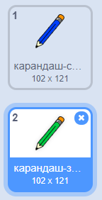
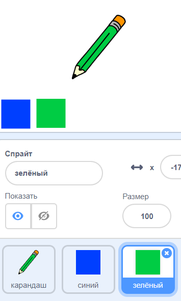

## Цветные карандаши

Давайте добавим в ваш проект разные цветные карандаши и позволяем пользователю выбирать между ними.

+ Нажмите на свой карандашный спрайт, нажмите «Костюмы» и дублируйте свой «карандашный синий костюм».


+ Переименуйте новый костюм «карандаш-зеленый» и покрасьте зеленый карандаш.



[[[generic-scratch-rename-sprite]]]

+ Нарисуйте два новых спрайта - один синий квадрат и один зеленый квадрат. Вы будете использовать их, чтобы выбрать синий или зеленый карандаш.



+ Переименуйте свои спрайты так, чтобы их называли «синими» и «зелеными»,

+ Добавьте код в «зеленый» спрайт , так что , когда она нажата, то будет `широковещательных`{: класс = «blockevents»} сообщения «зеленый» на карандаш спрайт, рассказывающий его изменить свой костюм и карандаш цвета.


[[[generic-scratch-broadcast-message]]]

+ Переключитесь на свой карандашный спрайт. Добавьте некоторый код, чтобы, когда этот спрайт получает `широковещательный`{: class = "blockevents"} зеленый, он должен переключиться на зеленый костюм карандаша и изменить цвет пера на зеленый.


Для того, чтобы установить карандаш цвета к зеленому цвету, нажмите на цветной квадратик в `пере набора цвета`{: класс = «blockpen»} блок и нажмите на зеленом спрайте , чтобы выбрать один и тот же зеленый цвет , как ваш карандаш цвета.

+ Теперь вы можете сделать то же самое для значка синего карандаша: добавьте этот код в синий квадрат спрайт:

```blocks
когда этот спрайт нажал
трансляция [blue v]
```

... и добавьте этот код в карандашный спрайт:

```blocks
когда я получаю [синий v]
костюм переключателя к [карандашом-синему v]
установлен цвет пера [# 0000ff]
```

+ Наконец, добавьте этот код, чтобы сообщить карандашный спрайт, с которого начинается цвет, и убедитесь, что экран чист.


Мы решили начать с синего цвета, но если вы предпочитаете, вы можете начать с другого цветного карандаша.

+ Проверьте свой проект. Можете ли вы переключаться между синими и зелеными перьями, нажимая на синие или зеленые квадраты спрайтов?

