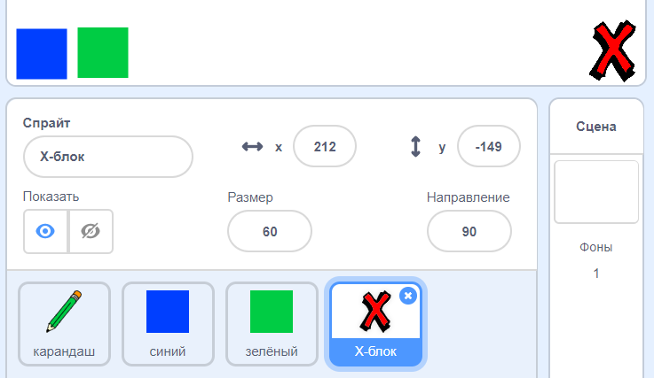
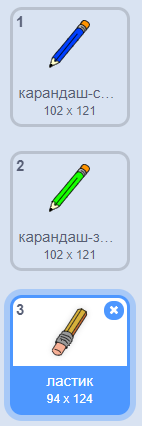

## Отменить ошибки

Иногда случаются ошибки, поэтому добавьте кнопку «Очистить» и кнопку «Ластик».

\--- task \--- Добавить спрайт 'X-block' из раздела букв библиотеки. Раскрась костюм спрайта в красный и сделай его немного меньше. Этот спрайт является кнопкой «Очистить».

[[[generic-scratch3-sprite-from-library]]]

 \--- / задача \---

\--- task \--- Добавить код к спрайту 'X-block', чтобы очистить рабочую область при щелчке спрайта


```blocks3
когда этот спрайт нажал
стереть все
```

\--- / задача \---

Вам не нужно использовать `широковещательную`{: class = "block3events"}, чтобы очистить сцену, потому что `стирают все блок`{: class = "block3extensions"} выполняет эту работу.

Вы видите, что карандашный спрайт включает костюм ластика?



Ваш проект также включает в себя отдельный ластик ластик.

\--- task \--- Щелкните правой кнопкой мыши по этому спрайту ластика и затем нажмите **показать** Вот как должна выглядеть ваша сцена сейчас:

 \--- / задача \---

\--- task \--- Добавьте код к спрайту ластика, чтобы отправить `'ластик' трансляции`{: class = "block3events"} при нажатии на спрайт ластика.


```blocks3
когда этот спрайт нажал
трансляцию (ластик v)
```

\--- / задача \---

Когда карандашный спрайт получает сообщение «ластик», он должен переключить свой костюм на ластик и переключить цвет пера на белый, который совпадает с цветом рабочей области!

\--- задача \--- Добавить код для создания ластика.

\--- подсказки \--- \--- подсказка \--- Добавьте некоторый код к карандашному спрайту: `Когда я получу`{: class = "block3events"} `ластика`{: class = "block3events"} сообщение `Переключиться в ластик костюма`{: class = "block3looks"} `Установить цвет пера`{: class = "block3extensions"} на белый \--- / hint \--- \--- hint \--- Вот все блоки, которые вам нужны:

```blocks3
установите цвет пера на [#FFFFFF]
когда я получу [ластик v]

переключите костюм на (ластик v)
```

\--- / подсказка \--- \--- подсказка \--- Вот как должен выглядеть код: 

```blocks3
когда я получаю [Ластик v]
переключите костюм на (Ластик v)
установите цвет пера на [#FFFFFF]
```

\--- / подсказка \--- \--- / подсказка \--- \--- / задача \---

\--- задача \--- Протестируйте свой проект, чтобы увидеть, можете ли вы очистить рабочую область и стереть карандашные линии.

 \--- / задача \---

Есть еще одна проблема с карандашом: вы можете рисовать где угодно на сцене, в том числе рядом с кнопками «Очистить» и Ластик!


\--- задача \--- Чтобы исправить это, измените код так, чтобы перо было только вниз, если щелкнуть мышью **и** положение указателя мыши `y` больше `-120`:


```blocks3
когда флажок установлен
стереть все
переключить костюм на (карандаш-синий v)
установить цвет пера на [# 0035FF]
навсегда
  перейти к (указатель мыши v)
+ если <<mouse down?> и <(мышь y) > [-120]>> затем 
  ручка вниз
  еще
  ручка вверх
конец
```

\--- / задача \---

\--- задача \--- Проверьте свой проект. Теперь вы не должны быть в состоянии рисовать рядом с кнопками.

 \--- / задача \---