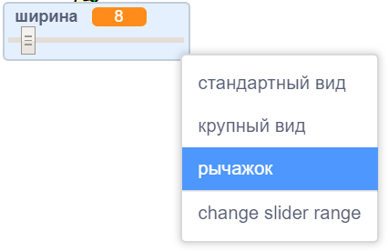
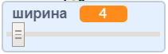

## Изменить ширину пера

Затем вы добавите код, позволяющий человеку, использующему вашу программу, рисовать вещи с разной шириной пера.

\--- task \--- Сначала добавьте новую переменную с именем `width`{: class = "block3variables"}

[[[generic-scratch3-add-variable]]] \--- / task \---

\--- task \--- Добавьте эту строку **внутри** цикла `forever`{: class = "block3control"} кода карандашного спрайта

```blocks3
когда флажок установлен
стереть все
переключить костюм на (карандаш-синий v)
установить цвет пера на [# 0035FF]
навсегда
перейти к (указатель мыши v)
+ установить размер пера на (width :: variable)
если <<mouse down?> и <(мышь y) > [-120]>> затем 
  пером вниз
  еще
  пером вверх
конец
```

\--- / задача \---

Ширина пера теперь неоднократно устанавливается равной значению переменной `width`{: class = "block3variables"}.

\--- task \--- Щелкните правой кнопкой мыши по переменной `width`{: class = "block3variables"}, отображаемой в рабочей области, а затем щелкните **бегунок**

 \--- / задача \---

Теперь вы можете перетащить ползунок, который виден под переменной, чтобы изменить значение переменной.



\--- task \--- Протестируйте ваш проект и посмотрите, сможете ли вы добавить код для настройки ширины пера

 \--- / задача \---