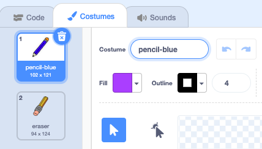

## වර්ණ පැන්සල්

දැන් ඔබ ඔබේ ව්‍යාපෘතියට(project එකට) විවිධ වර්ණ වලින් යුතු පැන්සල් එකතු කර, පරිශීලකයාට(user ට) ඒවා අතරින් තෝරා ගැනීමට ඉඩදෙනු ඇත.

\--- task \--- `නිල්-පැන්සල(pencil-blue)` ලෙස `පැන්සල්(pencil)` sprite එක නැවත නම්(rename) කරන්න 

 \--- /task \---

\--- task \--- පැන්සල් sprite එක මත දකුණ(right) ක්ලික්(click) කර 'නිල්-පැන්සල'('pencil-blue') ඇඳුම(costume එක) අනුපිටපත්(duplicate) කරන්න.

 \--- /task \---

\--- task \--- නව(new) ඇඳුම(costume එක) 'පැන්සල්-කොළ'('pencil-green') ලෙස නම් කර පැන්සල කොළ පාට කරන්න.


\--- /task \---

\--- task \--- නව(new) sprite දෙකක් අඳින්න: එක් නිල්(blue) චතුරස්රයක්(square) සහ එක් හරිත(green) චතුරස්රයක්(square). මේවා නිල් සහ කොළ පාට පැන්සල් අතර තෝරා(choosing) ගැනීම සඳහා යි.

 \--- /task \---

\--- task \--- නව sprites 'නිල්'('blue') සහ 'කොළ'('green') ලෙස නම් කරන්න.

[[[generic-scratch3-rename-sprite]]]

\--- /task \---

\--- task \--- කොළ(green) sprite එක ක්ලික් කළ විට, එය "කොළ" නැමති පණිවිඩය `විකාශනය(broadcasts)`{:class="block3events"} කරන පරිදි එයට කේතයක්(code එකක්) එක් කරන්න.


```blocks3
when this sprite clicked
broadcast (green v)
```

[[[generic-scratch3-broadcast-message]]] \--- /task \---

පැන්සල් sprite එක "කොළ" නැමති පණිවිඩයට සවන් දිය යුතු අතර ඊට ප්‍රතිචාර වශයෙන් එය තමාගේ ඇඳුම(costume එක) සහ වර්ණය වෙනස් කළ යුතුය.

\--- task \--- ඔබේ පැන්සල් sprite එක වෙත මාරු වන්න. මෙම sprite එකට `කොළ`{:class="block3events"} විකාශනය(broadcast එක) ලැබෙන විට, එය කොළ පැන්සල් ඇඳුමට(costume එකට) මාරු වී පැන්සලේ වර්ණය කොළ පැහැයට වෙනස් කරන පරිදි එයට කේතයක්(code එකක්) එක් කරන්න. 


```blocks3
when I receive [green v]
switch costume to (pencil-green v)
set pen color to [#00CC44]
```

පැන්සලේ වර්ණයට කොළ පාටට සැකසීමට, `පෑනෙහි වර්ණ සකසන(set pen color)`{:class="block3extensions"} කට්ටිය(block එක) තුළ ඇති වර්ණ(coloured) චතුරස්රය(square එක) මත ක්ලික් කරන්න, ඉන්පසු කොළ(green) හතරැස්(square) sprite එක මත ක්ලික් කරන්න. \--- /task \---

දැන් මෙවැනිම දෙයක් මගින් පැන්සල් වර්ණය නිල් පාටට මාරු කිරීම.

\--- task \--- නිල්(blue) හතරැස්(square) sprite එක මත ක්ලික් කර මෙම කේතය(code එක) එක් කරන්න:


```blocks3
when this sprite clicked
broadcast (blue v)
```

ඉන්පසු පැන්සල් sprite එක මත ක්ලික් කර මෙම කේතය(code එක) එක් කරන්න: 

```blocks3
when I receive [blue v]
switch costume to (pencil-blue v)
set pen color to [#0000ff]
```

\--- /task \---

\--- task \--- අවසාන වශයෙන්, පැන්සල් sprite එක කුමන වර්ණයෙන් ආරම්භ කළ යුතු දැයි පැවසීමට සහ ඔබේ වැඩසටහන(program) ආරම්භ වන විට තිරය(screen) අස්කර(clear කර) ගැනීමට මෙම කේතය(code එක) එක් කරන්න.


```blocks3
when flag clicked
+erase all
+switch costume to (pencil-blue v)
+set pen color to [#0035FF]
forever
  go to (mouse pointer v)
if <mouse down?> then
  pen down
  else
  pen up
end
```

\--- /task \---

ඔබ කැමති නම්, ඔබට වෙනත් වර්ණ පැන්සලකින් ආරම්භ කළ හැකිය.

\--- task \--- ඔබේ කේතය(code එක) පරීක්ෂා(test) කරන්න. නිල්(blue) හෝ කොළ(green) චතුරස්රාකාර(square) sprites මත ක්ලික් කිරීමෙන් ඔබට නිල් සහ කොළ පැන්සල් වර්ණ අතර මාරු විය හැකිද?

 \--- /task \---