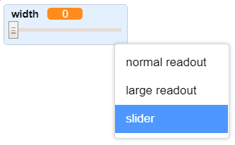

## පැන්සල් තුඩේ පළල වෙනස් කිරීම

ඊළඟට ඔබේ වැඩසටහන භාවිතා කරන පුද්ගලයාට විවිධ පළල(widths) සහිත පෑන් තුඩවල් වලින් දේවල් ඇඳීමට ඉඩ සැලසීමට කේතයක්(code එකක්) එකතු කරන්න. 

\--- task \--- පළමුව `පළල(width)`{:class="block3variables"} නමින් නව(new) විචල්‍යයක්(variable එකක්) සාදන්න.

[[[generic-scratch3-add-variable]]] \--- /task \---

\--- task \--- පැන්සල් sprite එකේ කේතයේ(code එකේ) `අපරිමිත(forever)`{:class="block3control"} ලූපය(loop එක) **ඇතුළත(inside)** මෙම පේළිය(line එක) එක් කරන්න:

```blocks3
when flag clicked
erase all
switch costume to (pencil-blue v)
set pen color to [#0035FF]
forever
go to (mouse pointer v)
+set pen size to (width :: variables)
if <<mouse down?> and <(mouse y) > [-120]>> then
  pen down
  else
  pen up
end
```

\--- /task \---

පෑන් තුඩේ පළල දැන් නැවත නැවතත්(repeatedly) `පළල(width)`{:class="block3variables"} විචල්‍යයයේ(variable එකේ) අගයට සැකසෙනු(set වෙනු) ඇත. 

\--- task \--- වේදිකාව මත දර්ශනය වන `පළල(width)`{:class="block3variables"} විචල්‍යය(variable එක) මත දකුණු-ක්ලික්(right-click) කර **ස්ලයිඩරය(slider)** මත ක්ලික් කරන්න.

 \--- /task \---

විචල්‍යයේ(variable එකේ) අගය වෙනස් කිරීම සඳහා ඔබට දැන් විචල්‍යයට(variable එකට) පහළින් පෙනෙන ස්ලයිඩරය(slider එක) අදීම කල හැකිය.


\--- task \--- ඔබේ ව්‍යාපෘතිය පරීක්ෂා කර, පෑන් තුඩේ පළල(width එක) සැකසීමට කේතයක් එකතු කළ හැකිදැයි බලන්න.

 \--- /task \---