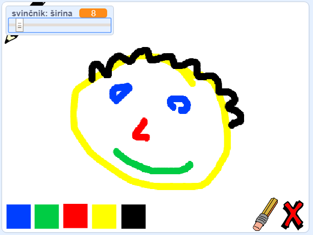

\--- no-print \---

To je ** Scratch 3 ** različica projekta. Obstaja tudi [Scratch 2](https://projects.raspberrypi.org/en/projects/paint-box-scratch2) različica projekta.

\--- /no-print \---

## Uvod

Ustvari svoj risarski program!

### Kaj boš naredil-a

\--- no-print \---

Za začetek klikni na zeleno zastavico. Uporabi miško za premikanje svinčnika in drži levo tipko miške za risanje. Klikni na barvo, da zamenjaš barvo. Klikni na radirko, da jo izbereš in jo uporabiš za brisanje. Če želiš pobrisati cel list, klikni na križec.

  <iframe allowtransparency="true" width="485" height="402" src="//scratch.mit.edu/projects/embed/267243161/?autostart=false" frameborder="0" scrolling="no"></iframe>
  

\--- /no-print \---

\--- print-only \---

Zaženi program s klikom na zeleno zastavico in uporabi miško za premikanje svinčnika. Drži levo tipko miške za risanje. Če klikneš na barvo, se bo spremenila barva svinčnika, klik na radirko pa bo izbral radirko!

\--- /print-only \---

## \--- collapse \---

## title: Kaj se boš naučil-a?

+ V Scratch dodaj razširitev za svinčnik
+ Uporabi sporočila za upravljanje figure v Scratchu
+ Obnovi znanje o tem, kako se odzivati na dogodke z miško

\--- /collapse \---

## \--- collapse \---

## title: Kaj potrebuješ?

### Strojna oprema

+ Računalnik, ki lahko poganja Scratch 3

### Programska oprema

+ Scratch 3 (bodisi [na spletu](http://rpf.io/scratchon) {:target = "_blank"} ali [brez povezave](http://rpf.io/scratchoff){:target = "_blank"})

### Prenosi

+ [Začetni projekt brez povezave](http://rpf.io/p/en/paint-box-go){: target = "_ blank"}

\--- /collapse \---

## \--- collapse \---

## title: Dodatne informacije za izobraževalce

Če želite natisniti ta projekt, uporabite [tiskalniku prijazno različico](https://projects.raspberrypi.org/en/projects/paint-box/print){:target="_blank"}.

Zaključen projekt lahko najdete [tukaj](http://rpf.io/p/en/paint-box-get)"}.

\--- /collapse \---