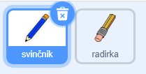
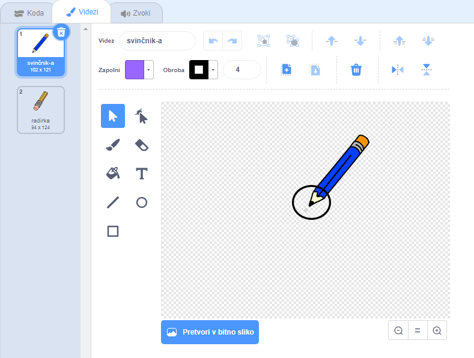

## Ustvari svinčnik

Začni z izdelavo svinčnika, ki ga lahko uporabiš za risanje po odru.

\--- task \--- Odpri začetni projekt 'Barvice'

**S povezavo:** odpri nov spletni Scratch projekt na [rpf.io/paint-box-on](http://rpf.io/paint-box-on){:target="_blank"}

Če imaš Scratch uporabniški račun, lahko ustvariš kopijo s klikom na **Predelaj**.

** Brez povezave ** : odpri začetni projekt [ ](http://rpf.io/p/en/paint-box-go) {: target = "_ blank"} v namiznem urejevalniku.

Če želiš prenesti in namestiti Namizni Scratch, ga lahko najdeš na [rpf.io/scratchoff](http://rpf.io/scratchoff){: target = "_ blank"}

V začetnem projektu bi moral videti figuri svinčnika in radirke:

 \--- /task \---

\--- task \---

V svoj projekt dodaj razširitev Svinčnik.

[[[generic-scratch3-add-pen-extension]]]

\--- /task \---

\--- task \---

Figuri svinčnika dodaj nekaj kode, ki bo omogočila, da figura sledi kazalcu miške in da se to `ponavlja` {:class="block3control"}, tako da lahko rišeš:


```blocks3
ko kliknemo na zastavico
ponavljaj
pojdi na (kazalcu miške v)
konec
```

\--- /task \---

\--- task \--- Klikni zastavico in premikaj kazelec miške po odru, da vidiš ali tvoja koda deluje. \--- /task \---

Nato naredi, da bo tvoj svničnik risal le `če`{:class="block3control"} je pritisnjena tipka na miški.

\--- task \--- Figuri svinčnika dodaj to kodo:


```blocks3
ko kliknemo na zastavico
ponavljaj
  pojdi na (kazalec miške v)

+ če <mouse down?> potem
  sputi pero
  sicer
  dvigni pero
konec
```

\--- /task \---

\--- task \--- Ponovno preizkusi kodo. Tokrat premikaj svinčnik po odru in hkrati stisni tipko miške. Can you draw with your pencil?

 \--- /task \---

## \--- kolaps \---

## title: Ali vaš svinčnik ne črpa iz konice?

If the line your pencil draw looks like it is coming from the pencil's middle, you need to change your pencil sprite's so the tip is the sprite's centre.

Click on the pencil sprite, and then click on the **Costumes** tab.

Move the costume's so the tip of the pencil is **just above** the centre.



Now move the pencil around on the Stage and draw. The pencil should now draw a line from its tip.

\--- /collapse \---