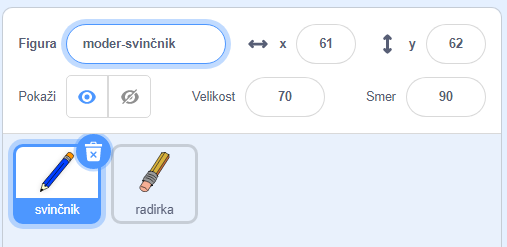
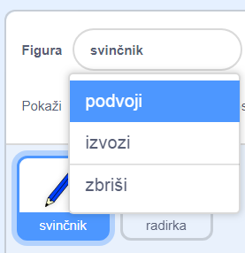
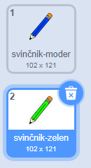
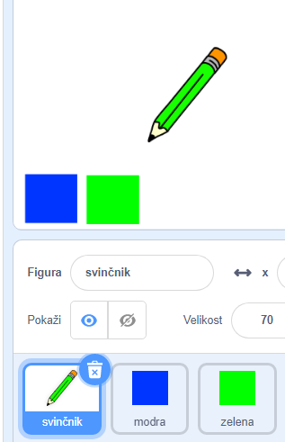

## Barvice

Svojemu projektu boše sedaj dodal različne barvne svinčnike in uporabniku omogočil izbiro med njimi.

\--- task \--- Z desno tipko klikni na figuro `svinčnik` in preimenuj videz v `'svinčnik-moder'`

 \--- /task \---

\--- task \--- Z desno tipko klikni na videz 'svinčnik-moder' in ga podvoji.

 \--- /task \---

\--- task \--- Poimenuje novi videz 'svinčnik-zelen', in ga obarvaj zeleno.



\--- /task \---

\--- task \--- Nariši dve novi figuri: en moder in en zelen kvadrat. Namenjena sta izbiri med modro in zeleno barvico.

 \--- /task \---

\--- task \--- Preimenuj novi figuri v 'modra' in 'zelena'

[[[generic-scratch3-rename-sprite]]]

\--- /task \---

\--- task \--- Figuri 'zelena' dodaj kodo, ki povhzroči, da klik na figuro `objavi`{:class="block3events"} sporočilo 'zelena'.


```blocks3
ko kliknemo to figuro
objavi (zelena v)
```

[[[generic-scratch3-broadcast-message]]] \--- /task \---

Figura svinčnika naj spremlja objave in v primeru prejema sporočila 'zelena' spremeni svoj videz in barvo svinčnika.

\--- task \--- Preklopi na figuro svinčnika. Dodaj kodo, ki bo omogočila, da bo figura `zelena`{:class="block3events"} prejela objavo, preklopila na videz zelene barvice in spremenila barvo svinčnika na zeleno.


```blocks3
ko prejmem [zelena v]
zamenjaj videz na (svinčnik-zelen v)
nastavi barvo peresa na [#00CC44]
```

Da bi spremenil barvo svinčnika na zeleno, najprej klikni na obarvan kvadrat v bloku `nastavi barvo peresa na`{:class="block3extensions"}, izberi kapaljko in potem klikni na figuro z zelenim kvadratom. \--- /task \---

Natao napravi podobno stvar še za izbiro modre barve.

\--- task \--- Klikni na figuro modrega kvadrata in dodaj to kodo:


```blocks3
ko kliknemo to figuro
objavi (modra v)
```

Nato klikni na figuro svinčnika in dodaj to kodo: 

```blocks3
ko prejmem [modra v]
zamenjaj videz na (svinčnik-moder v)
nastavi barvo peresa na [#0000ff]
```

\--- /task \---

\--- task \--- Na koncu dodaj še to kodo, da poveš svinčniku, katera naj bo začetna barva in da poskrbiš, da bo zaslon ob zagonu programa prazen.


```blocks3
ko kliknemo na zastavico
+ izbriši vse
+ zamenja videz na (svinčnik-moder v)
+ nastavi barvo peresa na [#0035FF]
ponavljaj
  pojdi na (kazalec miške v)
  če <mouse down?> potem
    spusti pero
  sicer
    dvigni pero
konec
```

\--- /task \---

Če želiš, lahko izbereš tudi drugo začetno barvo.

\--- task \--- Preizkusi svojo kodo. Ali lahko s klikom na barvna kvadrata preklapljaš med modro in zeleno barvo svinčnika?

 \--- /task \---