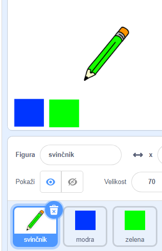
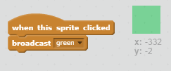

## Barvni svinčniki

Dodajte različne barvne svinčnike v svoj projekt in uporabniku omogočite, da izbere med njimi.

+ Kliknite na svoj svinčnik za svinčnik, kliknite »Kostumi« in podvojite kostum «svinčnik-modra».


+ Preimenujte svoj novi kostum "svinčnik-zeleni" in barvite svinčnik zeleno.


[[[generic-scratch-rename-sprite]]]

+ Pripravite dve novi spriži - en modri kvadrat in en zeleni kvadrat. Uporabili jih boste za izbiro modrega ali zelenega svinčnika.



+ Preimenuj svoje sprite, tako da jih imenujemo "modra" in "zelena"

+ Dodajte kodo v zeleni sprite tako, da bo ob kliku `oddajal`{: class = "blockevents"} sporočilo "zeleno" pisalniku svinčnika in mu sporočil, naj spremeni svojo kostum in barvo svinčnika.



[[[generic-scratch-broadcast-message]]]

+ Preklopite na svinčnik svinčnika. Dodajte nekaj kode, tako da, ko ta sprite prejme `oddaje`{: class = "blockevents"} zeleno, mora preklopiti na kostum zelene svinčnika in spremeniti barvo pisala na zeleno.


Če želite, da svinčnik označi zeleno, kliknite barvno polje v `nastavljenem barvnem peresniku`{: class = "blockpen"} in kliknite zeleno mapo, da izberete isto barvo, zeleno kot barva svinčnika.

+ Zdaj lahko storite enako za ikono modrega svinčnika: dodajte to kodo v modri kvadratni sprite:

```blocks
ko je ta sprite kliknila oddajo [modra v]
```

... in dodajte to kodo na svinčnik svinčnika:

```blocks
ko prejmem kostum stikala [modra v] na [pencil-blue v], nastavite barvo peresa na [# 0000ff]
```

+ Končno dodajte to kodo, da poveste svinčniku svinčnika, s katerim se začne barva, in se prepričajte, da je zaslon jasen.


Odločili smo se za začetek z modrim, vendar če želite, lahko začnete z drugačnim barvnim svinčnikom.

+ Preizkusite svoj projekt. Ali lahko preklapljate med modrimi in zelenimi pisali s klikom na modre ali zelene kvadratne sprite?

