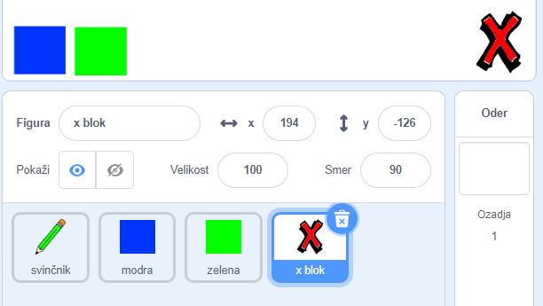
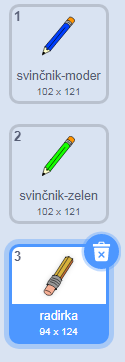
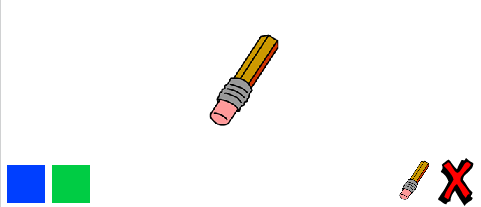

## Razveljavi napake

Včasih pride do napak, zato dodajte gumb »jasno« in gumb za brisanje.

\--- naloga \--- Dodajte 'X-blok' iz spisa knjižnice. Barvite kostum duhov v rdeči barvi in ga nekoliko zmanjšajte. Ta Sprite je gumb 'jasno'.

[[[generic-scratch3-sprite-from-library]]]

 \--- / naloga \---

\--- naloga \--- Dodajte kodo v '' X-blok '' sprite, da počistite stopnjo, ko se je geslo kliknilo.


```blocks3
ko je ta geslo kliknilo
izbrisati vse
```

\--- / naloga \---

Vam ni treba uporabiti že `oddajanja`{: class = "block3events"}, da počistite Stage, ker je `brisanje vseh`{: class = "block3extensions"} blok pa to delo.

Ali vidite, da je sprajt za svinčnik opremljen z radirko?



V vaš projekt je vključen tudi ločen brisalni sprite.

\--- naloga \--- desno miškino tipko kliknite ta radirka in nato kliknite na **prikaz**. Tukaj lahko vidite, kako naj bo vaša stopnja zdaj:

 \--- / naloga \---

\--- naloga \--- Dodajte kodo za brisalni sprite za pošiljanje `'radirke' oddaje`{: class = "block3events"}, ko se klikne brisalni sprit.


```blocks3
ko je ta geslo kliknilo
oddaje (radirka v)
```

\--- / naloga \---

Ko svinčnik sprite sprejme "radirko" sporočilo, mora preklopiti svoj kostum na radirko in preklopiti barvo peresa na belo, ki je enake barve kot Stage!

\--- naloga \--- Dodajte nekaj kode za ustvarjanje radirke.

\--- namigi \--- \--- namig \--- Dodajte kodo za sprite svinčnika: `Ko prejmem`{: class = "block3events"} `radirke`{: class = "block3events"} message `Preklopi na kostumsko brisalo`{: class = "block3looks"} `Nastavi barvo peresa`{: class = "block3extensions"} na belo \--- / namig \--- \--- namig \--- Tu so vsi bloki, ki jih potrebujete:

```blocks3
nastavite barvo peresa na [#FFFFFF]
ko prejmem kljukico [radirka v]

v (radirka v)
```

\--- / namig \--- \--- namig \--- Tukaj je, kako naj izgleda koda: 

```blocks3
ko prejmem [radirka v]
preklopite kostum na (radirka v)
nastavite barvo peresa na [#FFFFFF]
```

\--- / namig \--- \--- / namigi \--- \--- / naloga \---

\--- naloga \--- Preizkusite svoj projekt, da vidite, če lahko počistite stopnjo in izbrišete črte svinčnika.

 \--- / naloga \---

Še ena težava s svinčnikom: lahko povlečete kjerkoli na odru, tudi blizu "jasnih" in brisalnih gumbov!


\--- naloga \--- Če želite to popraviti, spremenite kodo tako, da je pero le navzdol, če miško kliknete **in** položaj `y` kazalca miške pa je večji od `-120`:


```blocks3
ko zastave klikne
izbrisali vse
Stikalo noša do (svinčnika-modro V)
set barve svinčnikom [# 0035FF]
veke
  kraju (mouse pointer v)
+ če <<mouse down?> in <(miš y) > [-120]>> potem 
  pero navzdol
  še
  pero do
konca
```

\--- / naloga \---

\--- naloga \--- Preizkusite svoj projekt. Zdaj ne smete risati blizu gumbov.

 \--- / naloga \---