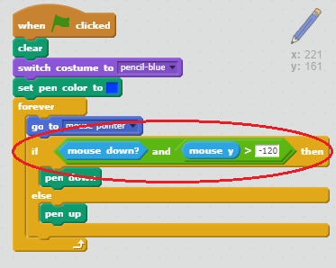

## Napake

Včasih se zgodi napaka, zato dodamo "jasen" gumb in izbirnik.

+ Dodaj sprite "X-block" - najdete ga v knjižnici v razdelku s črkami. Barva kostuma rdeče. To bo postalo "jasen" gumb.


+ Dodajte kodo v ta sprite, da izbrišete fazo, ko jo kliknete.


Upoštevajte, da vam ni treba poslati sporočila, da izbrišete oder, lahko uporabite čisti blok iz tega sprita.

Verjetno ste opazili, da vaš svinčnik za svinčnik vključuje kostum radirke:


+ Vaš projekt vsebuje tudi ločen sprite za radirke. Desni klik na ta sprite in izberite "show". Tukaj je, kako bi izgledal vaš oder:


+ Dodajte kodo v brisalko, da poveste svinčniku, da preklopi na radirko, ko se klikne sprite.


Ko svinčnik prejme sporočilo »eraser«, lahko kostum svinčnika preklopite na radirko in barvo svinčnika preklopite na belo - enako barvo kot na odru!

+ Dodajte nekaj kode, da ustvarite radirko

\--- namige \--- \--- nasvet \--- Dodajte kodo v škatlo s svinčnikom: **Ko prejmem** **eraser** sporočilo **Preklopi na kostum** eraser **Nastavite barvo pisala** v beli \--- / namig \--- \--- namig \--- Tukaj je, kako naj bo koda v svinčniku svinčnika videti:

```blocks
ko prejmem [eraser v] preklopni kostum, na [eraser v] nastavite barvo peresa na [#FFFFFF]
```

\--- / namig \--- \--- / namigi \---

+ Preizkusite svoj projekt in preverite, ali lahko izbrišete in izbrišete na odru.


Obstaja še ena težava s svinčnikom - lahko si povlečete kjerkoli na odru, tudi v bližini ikon selektorja!


Če želite to popraviti, povejte svinčniku le, če kliknete miško *in* , če je položaj y-miške večji od -120:



+ Preizkusite svoj projekt; zdaj ne bi smeli biti v bližini izbirnih blokov.

