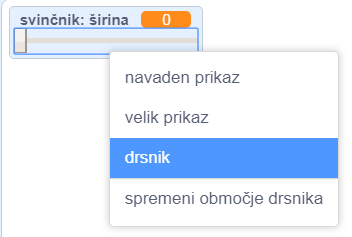
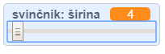

## Spremenite širino peresa

Nato boste dodali kodo, ki bo osebi, ki uporablja vaš program, lahko risala stvari z različnimi širinami peresa.

\--- naloga \--- Najprej dodajte novo spremenljivko `width`{: class = "block3variables"}.

[[[generic-scratch3-add-variable]]] \--- / naloga \---

\--- naloga \--- Dodaj to vrstico **znotraj** `vedno`{: class = "block3control"} zanke kode svinčnika:

```blocks3
ko zastave klikne
izbrisali vse
Stikalo noša do (svinčnika-modro V)
set barve svinčnikom [# 0035FF]
veke
kraju (mouse pointer v)
+ določiti velikost pero (širina :: spremenljivk)
če <<mouse down?> in <(miška y) > [-120]>> in 
  pero navzdol
  drugo
  pero do
konca
```

\--- / naloga \---

Širina peresa je vedno večkrat nastavljena na vrednost spremenljivke `širina`{: class = "block3variables"}.

\--- naloga \--- desno miškino tipko kliknite spremenljivko `širina`{: class = "block3variables"}, ki je prikazana na stopnji, in nato kliknite **drsnik**.

 \--- / naloga \---

Zdaj lahko povlečete drsnik, ki je viden pod spremenljivko, da spremenite vrednost spremenljivke.



\--- naloga \--- Preizkusite svoj projekt in preverite, ali lahko dodate kodo za prilagoditev širine peresa.

 \--- / naloga \---