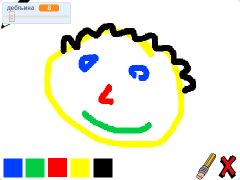

\--- no-print \---

Ово је **Scratch 3** верзија пројекта. Постоји, такође, и [Scratch 2 верзија пројекта](https://projects.raspberrypi.org/en/projects/paint-box-scratch2).

\--- /no-print \---

## Увод

Направи сопствени програм за цртање!

### Шта ћеш направити

\--- no-print \--- Кликни на зелену заставицу да почнеш. Користи миш да помераш оловку и држи притиснут леви тастер миша да црташ. Кликни на боју да промениш бојице. Кликни на гумицу да је употребиш да обришеш свој рад. Да обришеш страницу, кликни на крстић.

  <iframe allowtransparency="true" width="485" height="402" src="//scratch.mit.edu/projects/embed/267243161/?autostart=false" frameborder="0" scrolling="no"></iframe>
  

\--- /no-print \---

\--- print-only \--- Можеш кликнути на зелену заставицу да почнеш. Употреби миш како би померао оловку и држи притиснут десни тастер миша да црташ. Кликом на боју промениће се боја бојице, а кликом на гумицу појавиће се гумица!

 \--- /print-only \---

## \--- collapse \---

## title: Шта ћеш научити

+ Како користити проширење Оловка у Скречу
+ Како користити разгласе за комуникацију између ликова
+ Како открити догађаје миша \--- /collapse \---

## \--- collapse \---

## title: Шта ће ти бити потребно

### Хардвер

+ Рачунар који може да покрене Scratch 3

### Софтвер

+ Scratch 3 ([на мрежи](http://rpf.io/scratchon){:target="_blank"} или [ван мреже](http://rpf.io/scratchoff){:target="_blank"})

### Преузимање

+ [Почетни пројекат за уређивач ван мреже](http://rpf.io/p/en/paint-box-go){:target="_blank"}

\--- /collapse \---

## \--- collapse \---

## title: Додатне информације за наставнике

Уколико је потребно да одштампате овај пројекат, молимо Вас користите [Верзију за штампање](https://projects.raspberrypi.org/en/projects/paint-box/print){:target="_blank"}.

Решење овог пројекта можете пронаћи [овде](http://rpf.io/p/en/paint-box-get){:target="_blank"}. \--- /collapse \---