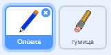
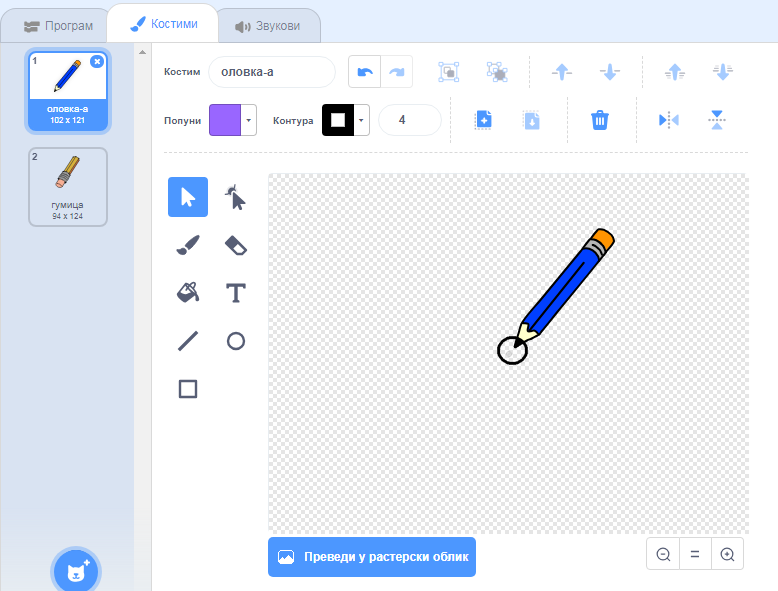

## Направи оловку

Почни тако што ћеш направити оловку која се може користити за цртање на позорници.

\--- task \--- Отвори Скреч почетни пројекат 'Програм за цртање'.

**На мрежи**: отвори почетни пројекат на [rpf.io/paint-box-on](http://rpf.io/paint-box-on){:target="_blank"}

If you have a Scratch account you can make a copy by clicking **Remix**.

**Offline**: open the [starter project](http://rpf.io/p/en/paint-box-go){:target="_blank"} in the offline editor.

If you need to download and install the Scratch offline editor, you can find it at [rpf.io/scratchoff](http://rpf.io/scratchoff){:target="_blank"}

In the starter project, you should see pencil and eraser sprites:

 \--- /task \---

\--- task \---

Add the Pen extension to your project.

[[[generic-scratch3-add-pen-extension]]]

\--- /task \---

\--- task \---

Add some code to the pencil sprite to make the sprite follow the mouse pointer `forever`{:class="block3control"} so that you can draw:


```blocks3
када је кликнуто на ⚑ :: events
понављај 
  иди до (показивач миша v) :: motion :: control
end
```

\--- /task \---

\--- task \--- Click the flag and then move the mouse pointer around the Stage to test whether your code works. \--- /task \---

Next, make your pencil only draw `if`{:class="block3control"} the mouse button is being clicked.

\--- task \--- Add this code to your pencil sprite:


```blocks3
када је кликнуто на ⚑ :: events
понављај 
  иди до (показивач миша v) :: motion
  + ако је <миш притиснут?> онда 
  +   спусти оловку :: pen
  + 
  +   подигни оловку :: pen :: control
  + end :: control
end
```

\--- /task \---

\--- task \--- Test your code again. This time, move the pencil around the Stage and hold down the mouse button. Can you draw with your pencil?

 \--- /task \---

## \--- collapse \---

## title: Да ли ваша оловка не црта из њеног врха?

If the line your pencil draw looks like it is coming from the pencil's middle, you need to change your pencil sprite's so the tip is the sprite's centre.

Click on the pencil sprite, and then click on the **Costumes** tab.

Move the costume's so the tip of the pencil is **just above** the centre.



Now move the pencil around on the Stage and draw. The pencil should now draw a line from its tip.

\--- /collapse \---