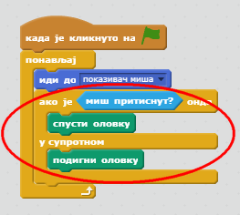

## Направи оловку

Почнимо тако што ћемо направити оловку која се може користити за цртање на позорници.

+ Отвори Скреч пројекат 'Програм за цртање' на мрежи на [jumpto.cc/paint-go](http://jumpto.cc/paint-go){:target="_blank"} или га преузми са <http://jumpto.cc/paint-get>{:target="_blank"}, а затим отвори ако користиш едитор ван мреже.

Видећеш ликове оловке и гумице:


+ Додај код лику оловке да `увек`{:class="blockcontrol"} прати стрелицу миша, тако да можеш да црташ:

```blocks
    when flag clicked
    forever
      go to [mouse pointer v]
    end
```

+ Кликни на заставицу, а затим померај миш по позорници да провериш да ли код функционише.

Затим, хајде да направимо да твоја оловка црта `ако је`{:class="blockcontrol"} притиснут тастер миша.

+ Додај овај код лику оловке:



+ Поново испробај код. Овај пут померај оловку по позорници док држиш тастер миша. Можеш ли да црташ својом оловком?


## \--- collapse \---

## title: Ако имаш проблеме...

Ако твоја оловка црта линију са своје средине уместо са врха, требаш да промениш центар костима.


Крст за одређивање центра оловке треба да буде постављен **тачно испод** врха оловке, а не на средину.

A changes in a sprite's 'costume center' isn't registered until another tab is clicked, so click on another costume, or on the 'Scripts' tab to finalise your changes to the costume center.

\--- /collapse \---