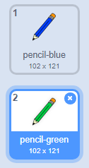

## Бојице

Сада ћеш у свој пројекат додати бојице различитих боја и омогућити кориснику да изабере ону коју жели.

\--- task \--- Промени лик `оловка` у `бојица-плава`

 \--- /task \---

\--- task \--- Кликни десним тастером миша на лик бојице и умножи костим 'бојица-плава'.

 \--- /task \---

\--- task \--- Назови нови костим 'бојица-зелена' и обоји бојицу у зелено.



\--- /task \---

\--- task \--- Нацртај два нова лика: плави квадрат и зелени квадрат. Они служе за одабир између плаве и зелене бојице.

 \--- /task \---

\--- task \--- Преименуј их тако да се зову 'плава' и 'зелена'

[[[generic-scratch3-rename-sprite]]]

\--- /task \---

\--- task \--- Додај следећи код лику 'зелена', тако да кад је кликнуто на овај лик, он `разгласи`{:class="block3events"} поруку "зелена".


```blocks3
када је кликнуто на овај лик
разгласи (зелена v)
```

[[[generic-scratch3-broadcast-message]]] \--- /task \---

Лик бојице би требало да чека на поруку "зелена" и да промени костим и боју бојице као одговор.

\--- task \--- Врати се на лик оловке. Додај код, тако да, када овај лик прими разглас `зелена`{:class="block3events"}, промени костим у бојица-зелена и боју бојице у зелену.


```blocks3
када примим [зелена v]
замени костим са (бојица-зелена v)
нека боја оловке буде [#00CC44]
```

Да подесиш бојицу да боји у зелену, кликни на обојени квадрат у блоку `нека боја оловке буде`{:class="block3extensions"}, а затим кликни на лик зеленог квадрата. \--- /task \---

Затим на сличан начин то уради и са плавом бојицом.

\--- task \--- Кликни на плави квадрат и додај следећи код:


```blocks3
када је кликнуто на овај лик
разгласи (плава v)
```

Затим, кликни на лик оловке да додаш следећи код: 

```blocks3
када примим [плава v]
замени костим са (бојица-плава v)
нека боја оловке буде [#0000ff]
```

\--- /task \---

\--- task \--- На крају, додај овај код да кажеш лику бојице са којом бојом да почне и да екран буде обрисан када се твој програм покрене.


```blocks3
када је кликнуто на ⚑
+обриши све
+замени костим са (бојица-плава v)
+нека боја оловке буде [#0035FF]
понављај заувек
  иди до (показивач миша v)
  ако је <mouse down?> онда 
    спусти оловку
  у супротном 
    подигни оловку
  end
end
```

\--- /task \---

Ако желиш, можеш почети са бојицом друге боје.

\--- task \--- Испробај свој код. Можеш ли да мењаш између плаве и зелене бојице када кликнеш на ликове плавог или зеленог квадрата?

 \--- /task \---